# washtrack-main schema map

_Generated 2026-09-05 by `scripts/schema-map`. Do not edit by hand; run `npm run schema:map`._

How this database fits together: every table, how they reference each other, which RLS policies guard them, what triggers and functions touch them, and which code talks to them.

## At a glance

|  | Count |
| --- | --- |
| Tables | 38 |
| Views | 1 |
| Declared foreign keys | 51 |
| Foreign keys into other schemas (auth.users etc.) | 12 |
| Inferred relationships (no constraint, matched by name) | 14 |
| Junction tables (many-to-many) | 3 |
| RLS policies | 131 |
| Triggers | 16 |
| SQL functions | 32 |
| Edge functions | 14 |
| Frontend files querying the DB | 59 |

## Domains

Tables grouped by how densely they reference each other. Hub tables (referenced by many others) get their own domain together with the tables that only reference them, and are drawn as stubs in every other domain diagram.

| Domain | Tables | Members |
| --- | --- | --- |
| [locations](clusters/locations.md) | 2 | [locations](tables/locations.md), [user_locations](tables/user_locations.md) |
| [users](clusters/users.md) | 7 | [activity_logs](tables/activity_logs.md), [audit_log](tables/audit_log.md), [system_settings](tables/system_settings.md), [system_settings_audit](tables/system_settings_audit.md), [ticket_views](tables/ticket_views.md), [user_message_views](tables/user_message_views.md), [users](tables/users.md) |
| [auth.users](clusters/auth_users.md) | 3 | [manager_approval_requests](tables/manager_approval_requests.md), [report_templates](tables/report_templates.md), [user_roles](tables/user_roles.md) |
| [client_portal_users](clusters/client_portal_users.md) | 10 | [client_portal_access_requests](tables/client_portal_access_requests.md), [client_portal_location_access](tables/client_portal_location_access.md), [client_portal_users](tables/client_portal_users.md), [payroll_pay_codes](tables/payroll_pay_codes.md), [payroll_work_type_map](tables/payroll_work_type_map.md), [rate_configs](tables/rate_configs.md), [wash_requests](tables/wash_requests.md), [work_items](tables/work_items.md), [work_logs](tables/work_logs.md), [work_types](tables/work_types.md) |
| [clients](clusters/clients.md) | 4 | [clients](tables/clients.md), [dealership_location_requests](tables/dealership_location_requests.md), [dealership_rates](tables/dealership_rates.md), [dealership_wash_batches](tables/dealership_wash_batches.md) |
| [payroll_employee_lines](clusters/payroll_employee_lines.md) | 4 | [payroll_employee_lines](tables/payroll_employee_lines.md), [payroll_hours_imports](tables/payroll_hours_imports.md), [payroll_periods](tables/payroll_periods.md), [payroll_run_lines](tables/payroll_run_lines.md) |
| [employee_comments](clusters/employee_comments.md) | 3 | [employee_comments](tables/employee_comments.md), [message_reads](tables/message_reads.md), [message_replies](tables/message_replies.md) |
| [tickets](clusters/tickets.md) | 3 | [ticket_line_items](tables/ticket_line_items.md), [ticket_replies](tables/ticket_replies.md), [tickets](tables/tickets.md) |
| [error_reports](clusters/error_reports.md) | 2 | [error_report_replies](tables/error_report_replies.md), [error_reports](tables/error_reports.md) |

## Full relationship map

Declared foreign keys only. Junction tables are collapsed into many-to-many edges. Views and inferred relationships are left out; see the domain and table pages for those.

```mermaid
erDiagram
  activity_logs {
    string id PK
  }
  auth_users["auth.users"] {
    uuid id PK
  }
  ticket_views {
    string id PK
  }
  user_message_views {
    string id PK
  }
  users |o--o{ audit_log : "changed_by"
  auth_users |o--o{ client_portal_access_requests : "reviewed_by"
  client_portal_users ||--o{ client_portal_access_requests : "portal_user_id"
  locations ||--o{ client_portal_access_requests : "location_id"
  auth_users |o--o{ client_portal_users : "approved_by"
  auth_users ||--o{ client_portal_users : "auth_user_id"
  clients |o--o{ dealership_location_requests : "created_client_id"
  clients |o--o{ dealership_location_requests : "matched_client_id"
  locations |o--o{ dealership_location_requests : "created_location_id"
  clients ||--o{ dealership_rates : "client_id"
  locations |o--o{ dealership_rates : "location_id"
  clients ||--o{ dealership_wash_batches : "client_id"
  locations ||--o{ dealership_wash_batches : "location_id"
  users |o--o{ employee_comments : "recipient_id"
  users }o--o{ employee_comments : "via message_reads"
  error_reports ||--o{ error_report_replies : "report_id"
  auth_users ||--o{ error_reports : "reported_by"
  auth_users |o--o{ error_reports : "responded_by"
  client_portal_users }o--o{ locations : "via client_portal_location_access"
  clients ||--o{ locations : "client_id"
  users }o--o{ locations : "via user_locations"
  auth_users ||--o{ manager_approval_requests : "employee_id"
  auth_users ||--o{ manager_approval_requests : "manager_id"
  auth_users |o--o{ manager_approval_requests : "reviewed_by"
  employee_comments ||--o{ message_replies : "comment_id"
  users ||--o{ message_replies : "user_id"
  payroll_pay_codes ||--o{ payroll_employee_lines : "pay_code_id"
  users |o--o{ payroll_employee_lines : "employee_id"
  payroll_employee_lines |o--o{ payroll_hours_imports : "employee_line_id"
  payroll_periods ||--o{ payroll_hours_imports : "period_id"
  users |o--o{ payroll_hours_imports : "employee_id"
  payroll_employee_lines |o--o{ payroll_run_lines : "employee_line_id"
  payroll_periods ||--o{ payroll_run_lines : "period_id"
  users |o--o{ payroll_run_lines : "employee_id"
  locations |o--o{ payroll_work_type_map : "location_id"
  payroll_pay_codes ||--o{ payroll_work_type_map : "pay_code_id"
  work_types ||--o{ payroll_work_type_map : "work_type_id"
  clients ||--o{ rate_configs : "client_id"
  locations ||--o{ rate_configs : "location_id"
  work_types ||--o{ rate_configs : "work_type_id"
  auth_users |o--o{ report_templates : "created_by"
  users |o--o{ system_settings : "updated_by"
  users |o--o{ system_settings_audit : "changed_by"
  tickets ||--o{ ticket_line_items : "ticket_id"
  tickets ||--o{ ticket_replies : "ticket_id"
  clients |o--o{ tickets : "client_id"
  locations |o--o{ tickets : "location_id"
  auth_users ||--o{ user_roles : "user_id"
  auth_users ||--o{ users : "id"
  locations |o--o{ users : "location_id"
  users |o--o{ users : "manager_id"
  client_portal_users ||--o{ wash_requests : "portal_user_id"
  locations ||--o{ wash_requests : "location_id"
  work_items ||--o{ wash_requests : "work_item_id"
  work_logs |o--o{ wash_requests : "fulfilled_work_log_id"
  rate_configs ||--o{ work_items : "rate_config_id"
  rate_configs |o--o{ work_logs : "rate_config_id"
  users ||--o{ work_logs : "employee_id"
  work_items |o--o{ work_logs : "work_item_id"
```

## Hub tables

| Table | Referenced by (tables) |
| --- | --- |
| [locations](tables/locations.md) | 11 |
| [users](tables/users.md) | 11 |

## Other pages

- [Functions, triggers and code coupling](functions.md)
- [RLS policy matrix](policies.md)
- `schema.json`: the whole graph as data, for other tooling

## Warnings and drift

Things that look inconsistent between the migrations, the generated types, and the code. Each one is either a real problem or a sign that something was changed in the Supabase dashboard without a migration.

- View `users_safe_view` is in types.ts but no migration defines it (defined via the dashboard).
- FK `employee_comments_location_id_fkey` (employee_comments.location_id -> locations) is in migrations but not in types.ts. It may have been dropped, or types.ts is stale.
- Function `get_super_admin_id` is exposed in types.ts but no migration defines it (created via the dashboard).
- Function `get_users_for_managers` is exposed in types.ts but no migration defines it (created via the dashboard).

## How to read the diagrams

- `||--o{` one-to-many, `|o--o{` optional parent (nullable FK), `||--o|` one-to-one, `}o--o{` many-to-many via a junction table.
- Dotted lines (`..`) are inferred from column names; there is no constraint in the database.
- `PK`, `FK`, `UK` mark primary, foreign and unique keys. `null` in the comment means the column is nullable.
- Inputs: `src/integrations/supabase/types.ts` (tables, columns, FKs, views, exposed functions), `supabase/migrations/*.sql` replayed in order (keys, RLS, triggers, function bodies, cross-schema FKs), `supabase/functions/` and `src/` (which code queries what).
