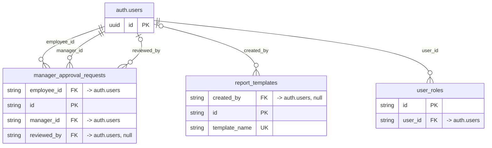

# Domain: auth.users

_Generated 2026-09-07 by `scripts/schema-map`. Do not edit by hand; run `npm run schema:map`._

[Back to overview](../README.md)

## Tables

| Table | Columns | RLS | Policies | Notes |
| --- | --- | --- | --- | --- |
| [manager_approval_requests](../tables/manager_approval_requests.md) | 10 | on | 5 |  |
| [report_templates](../tables/report_templates.md) | 12 | on | 4 |  |
| [user_roles](../tables/user_roles.md) | 4 | on | 10 |  |

## Relationships

Key columns only. Tables from other domains appear as stubs.

## Connections to other domains

- `auth.users`
