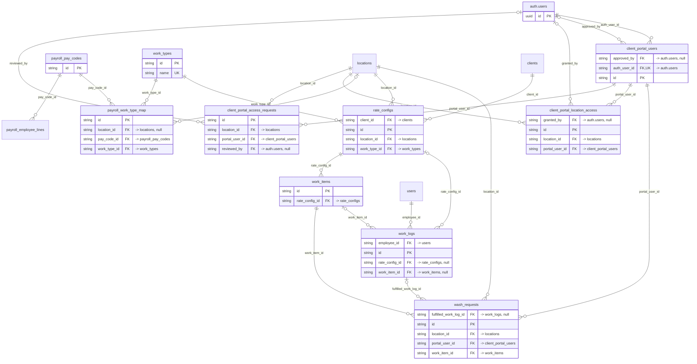

# Domain: client_portal_users

_Generated 2026-09-07 by `scripts/schema-map`. Do not edit by hand; run `npm run schema:map`._

[Back to overview](../README.md)

## Tables

| Table | Columns | RLS | Policies | Notes |
| --- | --- | --- | --- | --- |
| [client_portal_access_requests](../tables/client_portal_access_requests.md) | 10 | on | 4 |  |
| [client_portal_location_access](../tables/client_portal_location_access.md) | 5 | on | 3 | junction |
| [client_portal_users](../tables/client_portal_users.md) | 18 | on | 5 |  |
| [payroll_pay_codes](../tables/payroll_pay_codes.md) | 8 | on | 1 |  |
| [payroll_work_type_map](../tables/payroll_work_type_map.md) | 7 | on | 1 |  |
| [rate_configs](../tables/rate_configs.md) | 9 | on | 4 |  |
| [wash_requests](../tables/wash_requests.md) | 9 | on | 6 |  |
| [work_items](../tables/work_items.md) | 5 | on | 4 |  |
| [work_logs](../tables/work_logs.md) | 8 | on | 4 |  |
| [work_types](../tables/work_types.md) | 6 | on | 2 |  |

## Relationships

Key columns only. Tables from other domains appear as stubs.

## Connections to other domains

- `auth.users`
- [clients](../tables/clients.md) ([clients](../clusters/clients.md))
- [locations](../tables/locations.md) ([locations](../clusters/locations.md))
- [payroll_employee_lines](../tables/payroll_employee_lines.md) ([payroll_employee_lines](../clusters/payroll_employee_lines.md))
- [users](../tables/users.md) ([users](../clusters/users.md))
