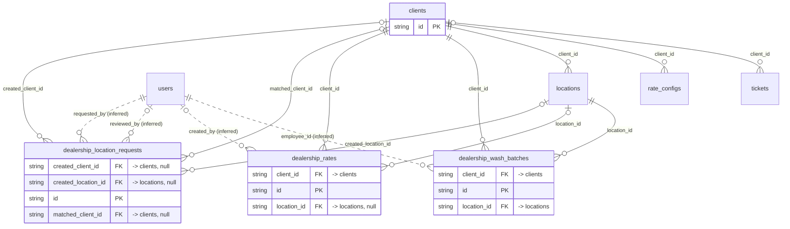

# Domain: clients

_Generated 2026-09-07 by `scripts/schema-map`. Do not edit by hand; run `npm run schema:map`._

[Back to overview](../README.md)

## Tables

| Table | Columns | RLS | Policies | Notes |
| --- | --- | --- | --- | --- |
| [clients](../tables/clients.md) | 15 | on | 3 |  |
| [dealership_location_requests](../tables/dealership_location_requests.md) | 17 | on | 4 |  |
| [dealership_rates](../tables/dealership_rates.md) | 10 | on | 4 |  |
| [dealership_wash_batches](../tables/dealership_wash_batches.md) | 10 | on | 4 |  |

## Relationships

Key columns only. Tables from other domains appear as stubs.

## Connections to other domains

- [locations](../tables/locations.md) ([locations](../clusters/locations.md))
- [rate_configs](../tables/rate_configs.md) ([client_portal_users](../clusters/client_portal_users.md))
- [tickets](../tables/tickets.md) ([tickets](../clusters/tickets.md))
- [users](../tables/users.md) ([users](../clusters/users.md))
