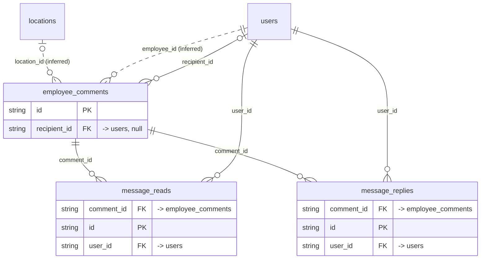

# Domain: employee_comments

_Generated 2026-09-05 by `scripts/schema-map`. Do not edit by hand; run `npm run schema:map`._

[Back to overview](../README.md)

## Tables

| Table | Columns | RLS | Policies | Notes |
| --- | --- | --- | --- | --- |
| [employee_comments](../tables/employee_comments.md) | 9 | on | 4 |  |
| [message_reads](../tables/message_reads.md) | 4 | on | 2 | junction |
| [message_replies](../tables/message_replies.md) | 5 | on | 4 |  |

## Relationships

Key columns only. Tables from other domains appear as stubs.

## Connections to other domains

- [locations](../tables/locations.md) ([locations](../clusters/locations.md))
- [users](../tables/users.md) ([users](../clusters/users.md))
