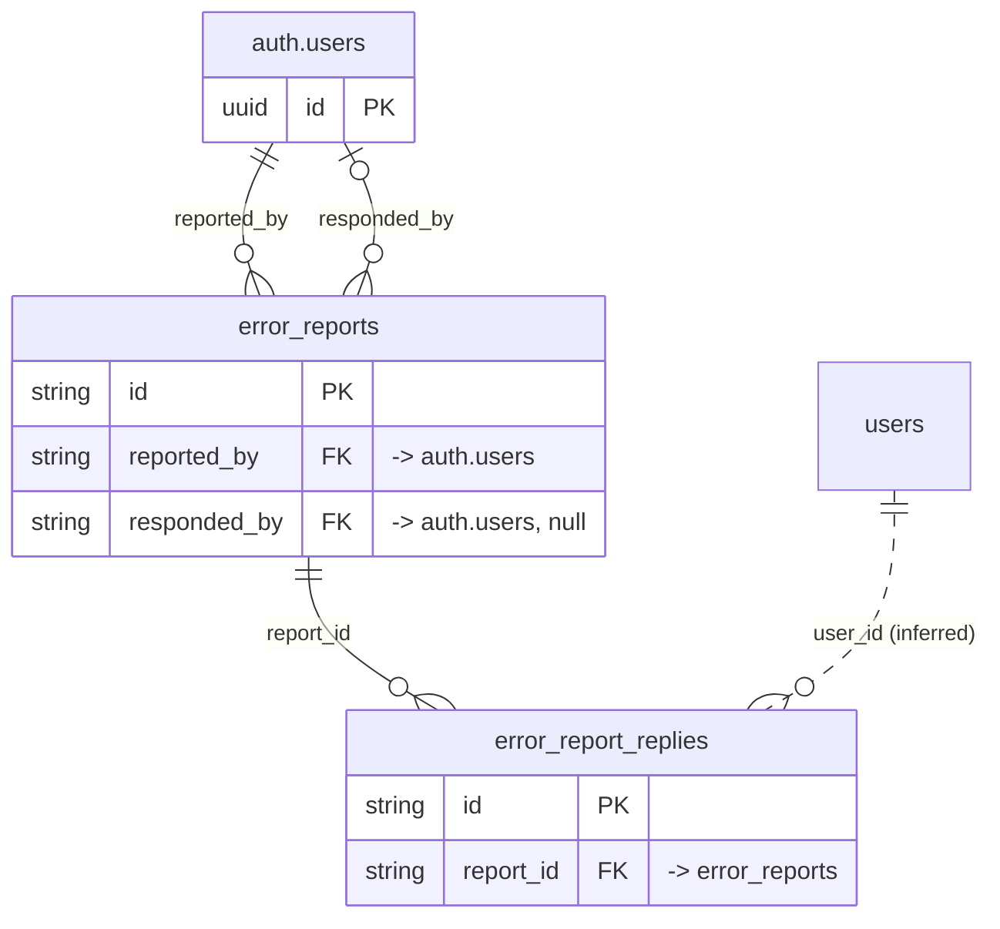

# Domain: error_reports

_Generated 2026-09-05 by `scripts/schema-map`. Do not edit by hand; run `npm run schema:map`._

[Back to overview](../README.md)

## Tables

| Table | Columns | RLS | Policies | Notes |
| --- | --- | --- | --- | --- |
| [error_report_replies](../tables/error_report_replies.md) | 5 | on | 2 |  |
| [error_reports](../tables/error_reports.md) | 12 | on | 4 |  |

## Relationships

Key columns only. Tables from other domains appear as stubs.

## Connections to other domains

- `auth.users`
- [users](../tables/users.md) ([users](../clusters/users.md))
