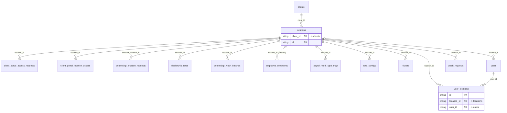

# Domain: locations

_Generated 2026-09-05 by `scripts/schema-map`. Do not edit by hand; run `npm run schema:map`._

[Back to overview](../README.md)

## Tables

| Table | Columns | RLS | Policies | Notes |
| --- | --- | --- | --- | --- |
| [locations](../tables/locations.md) | 9 | on | 4 | hub |
| [user_locations](../tables/user_locations.md) | 5 | on | 3 | junction |

## Relationships

Key columns only. Tables from other domains appear as stubs.

## Connections to other domains

- [client_portal_access_requests](../tables/client_portal_access_requests.md) ([client_portal_users](../clusters/client_portal_users.md))
- [client_portal_location_access](../tables/client_portal_location_access.md) ([client_portal_users](../clusters/client_portal_users.md))
- [clients](../tables/clients.md) ([clients](../clusters/clients.md))
- [dealership_location_requests](../tables/dealership_location_requests.md) ([clients](../clusters/clients.md))
- [dealership_rates](../tables/dealership_rates.md) ([clients](../clusters/clients.md))
- [dealership_wash_batches](../tables/dealership_wash_batches.md) ([clients](../clusters/clients.md))
- [employee_comments](../tables/employee_comments.md) ([employee_comments](../clusters/employee_comments.md))
- [payroll_work_type_map](../tables/payroll_work_type_map.md) ([client_portal_users](../clusters/client_portal_users.md))
- [rate_configs](../tables/rate_configs.md) ([client_portal_users](../clusters/client_portal_users.md))
- [tickets](../tables/tickets.md) ([tickets](../clusters/tickets.md))
- [users](../tables/users.md) ([users](../clusters/users.md))
- [wash_requests](../tables/wash_requests.md) ([client_portal_users](../clusters/client_portal_users.md))
