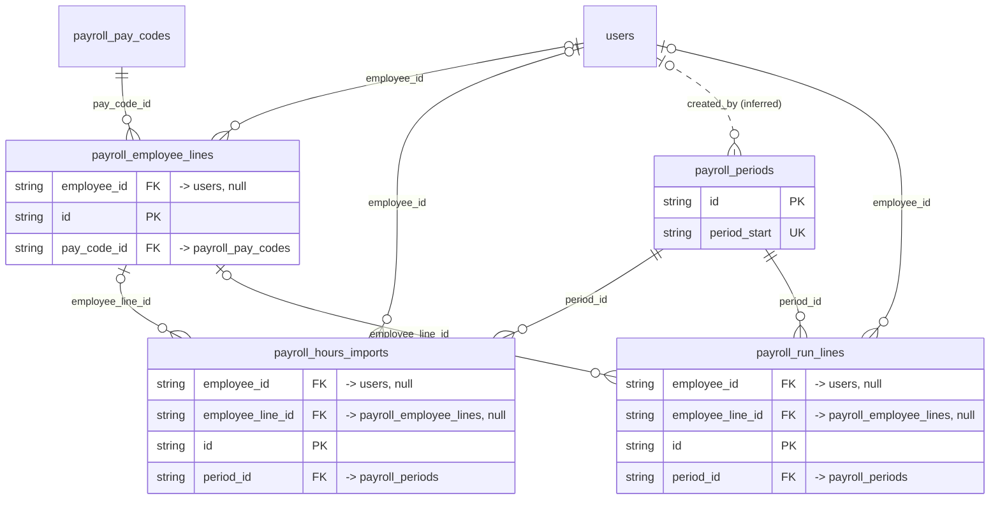

# Domain: payroll_employee_lines

_Generated 2026-09-05 by `scripts/schema-map`. Do not edit by hand; run `npm run schema:map`._

[Back to overview](../README.md)

## Tables

| Table | Columns | RLS | Policies | Notes |
| --- | --- | --- | --- | --- |
| [payroll_employee_lines](../tables/payroll_employee_lines.md) | 16 | on | 1 |  |
| [payroll_hours_imports](../tables/payroll_hours_imports.md) | 14 | on | 1 |  |
| [payroll_periods](../tables/payroll_periods.md) | 10 | on | 1 |  |
| [payroll_run_lines](../tables/payroll_run_lines.md) | 17 | on | 1 |  |

## Relationships

Key columns only. Tables from other domains appear as stubs.

## Connections to other domains

- [payroll_pay_codes](../tables/payroll_pay_codes.md) ([client_portal_users](../clusters/client_portal_users.md))
- [users](../tables/users.md) ([users](../clusters/users.md))
