# Domain: users

_Generated 2026-09-05 by `scripts/schema-map`. Do not edit by hand; run `npm run schema:map`._

[Back to overview](../README.md)

## Tables

| Table | Columns | RLS | Policies | Notes |
| --- | --- | --- | --- | --- |
| [activity_logs](../tables/activity_logs.md) | 8 | on | 2 |  |
| [audit_log](../tables/audit_log.md) | 8 | on | 2 |  |
| [system_settings](../tables/system_settings.md) | 9 | on | 3 |  |
| [system_settings_audit](../tables/system_settings_audit.md) | 7 | on | 2 |  |
| [ticket_views](../tables/ticket_views.md) | 4 | on | 3 |  |
| [user_message_views](../tables/user_message_views.md) | 4 | on | 3 |  |
| [users](../tables/users.md) | 47 | on | 8 | hub |

## Relationships

Key columns only. Tables from other domains appear as stubs.

```mermaid
erDiagram
  activity_logs {
    string id PK
  }
  audit_log {
    string changed_by FK "-> users, null"
    string id PK
  }
  auth_users["auth.users"] {
    uuid id PK
  }
  system_settings {
    string id PK
    string setting_key UK
    string updated_by FK "-> users, null"
  }
  system_settings_audit {
    string changed_by FK "-> users, null"
    string id PK
  }
  ticket_views {
    string id PK
    string user_id UK "?-> users"
  }
  user_message_views {
    string id PK
    string user_id UK "?-> users"
  }
  users {
    string email UK
    string employee_id UK
    string id PK, FK "-> auth.users"
    string location_id FK "-> locations, null"
    string manager_id FK "-> self, null"
  }
  users ||..o{ activity_logs : "user_id (inferred)"
  users |o--o{ audit_log : "changed_by"
  users ||..o{ dealership_location_requests : "requested_by (inferred)"
  users |o..o{ dealership_location_requests : "reviewed_by (inferred)"
  users |o..o{ dealership_rates : "created_by (inferred)"
  users ||..o{ dealership_wash_batches : "employee_id (inferred)"
  users ||..o{ employee_comments : "employee_id (inferred)"
  users |o--o{ employee_comments : "recipient_id"
  users ||..o{ error_report_replies : "user_id (inferred)"
  users ||--o{ message_reads : "user_id"
  users ||--o{ message_replies : "user_id"
  users |o--o{ payroll_employee_lines : "employee_id"
  users |o--o{ payroll_hours_imports : "employee_id"
  users |o..o{ payroll_periods : "created_by (inferred)"
  users |o--o{ payroll_run_lines : "employee_id"
  users |o--o{ system_settings : "updated_by"
  users |o--o{ system_settings_audit : "changed_by"
  users ||..o{ ticket_replies : "user_id (inferred)"
  users ||..o{ ticket_views : "user_id (inferred)"
  users |o..o{ tickets : "employee_id (inferred)"
  users ||..o{ tickets : "submitted_by (inferred)"
  users ||--o{ user_locations : "user_id"
  users ||..o{ user_message_views : "user_id (inferred)"
  auth_users ||--o{ users : "id"
  locations |o--o{ users : "location_id"
  users |o--o{ users : "manager_id"
  users ||--o{ work_logs : "employee_id"
```

## Connections to other domains

- [auth.users](../tables/auth_users.md)
- [dealership_location_requests](../tables/dealership_location_requests.md) ([clients](../clusters/clients.md))
- [dealership_rates](../tables/dealership_rates.md) ([clients](../clusters/clients.md))
- [dealership_wash_batches](../tables/dealership_wash_batches.md) ([clients](../clusters/clients.md))
- [employee_comments](../tables/employee_comments.md) ([employee_comments](../clusters/employee_comments.md))
- [error_report_replies](../tables/error_report_replies.md) ([error_reports](../clusters/error_reports.md))
- [locations](../tables/locations.md) ([locations](../clusters/locations.md))
- [message_reads](../tables/message_reads.md) ([employee_comments](../clusters/employee_comments.md))
- [message_replies](../tables/message_replies.md) ([employee_comments](../clusters/employee_comments.md))
- [payroll_employee_lines](../tables/payroll_employee_lines.md) ([payroll_employee_lines](../clusters/payroll_employee_lines.md))
- [payroll_hours_imports](../tables/payroll_hours_imports.md) ([payroll_employee_lines](../clusters/payroll_employee_lines.md))
- [payroll_periods](../tables/payroll_periods.md) ([payroll_employee_lines](../clusters/payroll_employee_lines.md))
- [payroll_run_lines](../tables/payroll_run_lines.md) ([payroll_employee_lines](../clusters/payroll_employee_lines.md))
- [ticket_replies](../tables/ticket_replies.md) ([tickets](../clusters/tickets.md))
- [tickets](../tables/tickets.md) ([tickets](../clusters/tickets.md))
- [user_locations](../tables/user_locations.md) ([locations](../clusters/locations.md))
- [work_logs](../tables/work_logs.md) ([client_portal_users](../clusters/client_portal_users.md))
