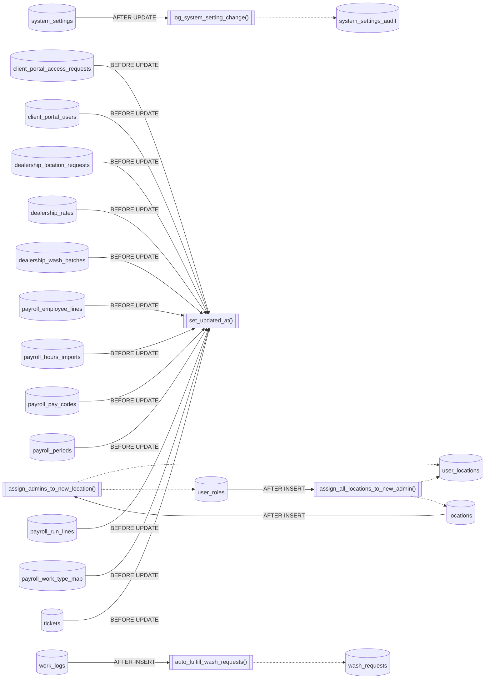
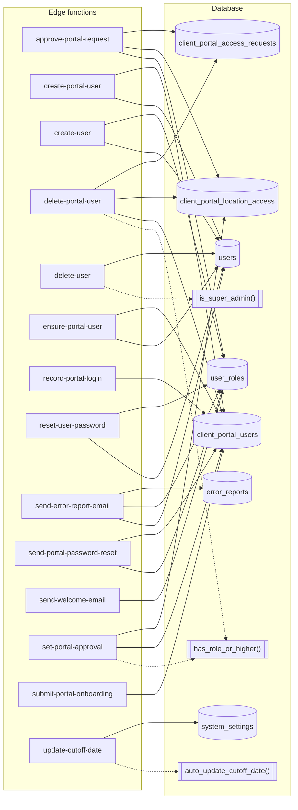

# Functions, triggers and code coupling

_Generated 2026-09-05 by `scripts/schema-map`. Do not edit by hand; run `npm run schema:map`._

[Back to overview](README.md)

## Triggers

What fires on writes, and which other tables the trigger function touches (dotted).

| Table | Trigger | When | Function | Defined in |
| --- | --- | --- | --- | --- |
| [client_portal_access_requests](tables/client_portal_access_requests.md) | `trg_client_portal_requests_updated` | BEFORE UPDATE FOR EACH ROW | `set_updated_at()` | `20260624214004_8a349c83-7751-43a6-8c27-1ece902bed41.sql` |
| [client_portal_users](tables/client_portal_users.md) | `trg_client_portal_users_updated` | BEFORE UPDATE FOR EACH ROW | `set_updated_at()` | `20260624214004_8a349c83-7751-43a6-8c27-1ece902bed41.sql` |
| [dealership_location_requests](tables/dealership_location_requests.md) | `trg_dealership_requests_updated` | BEFORE UPDATE FOR EACH ROW | `set_updated_at()` | `20260618054621_0b47f4fa-4cea-4f03-92ac-680a88e98bc8.sql` |
| [dealership_rates](tables/dealership_rates.md) | `trg_dealership_rates_updated` | BEFORE UPDATE FOR EACH ROW | `set_updated_at()` | `20260618054621_0b47f4fa-4cea-4f03-92ac-680a88e98bc8.sql` |
| [dealership_wash_batches](tables/dealership_wash_batches.md) | `trg_dealership_batches_updated` | BEFORE UPDATE FOR EACH ROW | `set_updated_at()` | `20260618054621_0b47f4fa-4cea-4f03-92ac-680a88e98bc8.sql` |
| [locations](tables/locations.md) | `trg_assign_admins_to_new_location` | AFTER INSERT FOR EACH ROW | `assign_admins_to_new_location()` | `20260622215501_c8893316-da9d-4d31-b795-acb43a86e177.sql` |
| [payroll_employee_lines](tables/payroll_employee_lines.md) | `trg_payroll_employee_lines_updated` | BEFORE UPDATE FOR EACH ROW | `set_updated_at()` | `20260901005118_4edf45d4-24b6-4f0b-8030-9002673617da.sql` |
| [payroll_hours_imports](tables/payroll_hours_imports.md) | `trg_payroll_hours_updated` | BEFORE UPDATE FOR EACH ROW | `set_updated_at()` | `20260901005118_4edf45d4-24b6-4f0b-8030-9002673617da.sql` |
| [payroll_pay_codes](tables/payroll_pay_codes.md) | `trg_payroll_pay_codes_updated` | BEFORE UPDATE FOR EACH ROW | `set_updated_at()` | `20260901005118_4edf45d4-24b6-4f0b-8030-9002673617da.sql` |
| [payroll_periods](tables/payroll_periods.md) | `trg_payroll_periods_updated` | BEFORE UPDATE FOR EACH ROW | `set_updated_at()` | `20260901005118_4edf45d4-24b6-4f0b-8030-9002673617da.sql` |
| [payroll_run_lines](tables/payroll_run_lines.md) | `trg_payroll_run_lines_updated` | BEFORE UPDATE FOR EACH ROW | `set_updated_at()` | `20260901005118_4edf45d4-24b6-4f0b-8030-9002673617da.sql` |
| [payroll_work_type_map](tables/payroll_work_type_map.md) | `trg_payroll_map_updated` | BEFORE UPDATE FOR EACH ROW | `set_updated_at()` | `20260901005118_4edf45d4-24b6-4f0b-8030-9002673617da.sql` |
| [system_settings](tables/system_settings.md) | `system_settings_audit_trigger` | AFTER UPDATE FOR EACH ROW | `log_system_setting_change()` | `20251011054150_29aaf8ff-e3c9-445f-8d01-bdf978d62c52.sql` |
| [tickets](tables/tickets.md) | `trg_tickets_updated` | BEFORE UPDATE FOR EACH ROW | `set_updated_at()` | `20260831234441_48116fbc-7407-44a6-b254-8ab925dbec00.sql` |
| [user_roles](tables/user_roles.md) | `trg_assign_all_locations_to_new_admin` | AFTER INSERT FOR EACH ROW | `assign_all_locations_to_new_admin()` | `20260622215501_c8893316-da9d-4d31-b795-acb43a86e177.sql` |
| [work_logs](tables/work_logs.md) | `trg_auto_fulfill_wash_requests` | AFTER INSERT FOR EACH ROW | `auto_fulfill_wash_requests()` | `20260721041612_70660937-8491-4e5d-a0c4-f7d58e6330ac.sql` |

## SQL functions

"Exposed" means callable through the API (present in types.ts). "In migrations: no" means the function only exists in the live database.

| Function | Args | Returns | Lang | Security | Touches | Exposed | In migrations |
| --- | --- | --- | --- | --- | --- | --- | --- |
| `assign_admins_to_new_location` |  | TRIGGER | plpgsql | definer | [user_locations](tables/user_locations.md), [user_roles](tables/user_roles.md) | no | yes |
| `assign_all_locations_to_new_admin` |  | TRIGGER | plpgsql | definer | [user_locations](tables/user_locations.md), [locations](tables/locations.md) | no | yes |
| `audit_wash_entries` |  | TRIGGER | plpgsql | definer | [audit_log](tables/audit_log.md) | no | yes |
| `audit_work_entries` |  | trigger | plpgsql | definer | [audit_log](tables/audit_log.md) | no | yes |
| `auto_fulfill_wash_requests` |  | trigger | plpgsql | definer | [wash_requests](tables/wash_requests.md) | no | yes |
| `auto_update_cutoff_date` |  | void | plpgsql | definer | [system_settings](tables/system_settings.md), [system_settings_audit](tables/system_settings_audit.md) | yes | yes |
| `can_delete_report_template` | _creator uuid | boolean | sql | definer |  | yes | yes |
| `disable_inactive_portal_users` |  | integer | plpgsql | definer | [client_portal_users](tables/client_portal_users.md) | yes | yes |
| `get_applicable_rate` | p_location_id UUID, p_client_id UUID DEFAULT NULL, p_vehicl… | TABLE ( rate NUMERIC, is_hourly BOOLEAN… | plpgsql | definer |  | yes | yes |
| `get_dealership_report_data` | p_start_date date, p_end_date date, p_client_ids text[] DEF… | TABLE( client_id text, client_name text… | plpgsql | definer | [dealership_wash_batches](tables/dealership_wash_batches.md), [clients](tables/clients.md), [locations](tables/locations.md) | yes | yes |
| `get_last_monday` |  | TIMESTAMP | plpgsql | definer |  | yes | yes |
| `get_next_sunday` |  | TIMESTAMP | plpgsql | definer |  | yes | yes |
| `get_portal_account_status` |  | TABLE( approval_status text, is_active … | sql | definer | [client_portal_users](tables/client_portal_users.md) | yes | yes |
| `get_portal_dealership_history` | p_location_id uuid, p_start date, p_end date | TABLE( work_date date, vehicle_count bi… | plpgsql | definer | [dealership_wash_batches](tables/dealership_wash_batches.md) | yes | yes |
| `get_portal_location_work_items` | p_location_id uuid | TABLE( work_item_id uuid, identifier te… | plpgsql | definer | [work_items](tables/work_items.md), [rate_configs](tables/rate_configs.md), [work_types](tables/work_types.md), [wash_requests](tables/wash_requests.md) | yes | yes |
| `get_portal_my_locations` |  | TABLE( location_id uuid, location_name … | sql | definer | [client_portal_location_access](tables/client_portal_location_access.md), [client_portal_users](tables/client_portal_users.md), [locations](tables/locations.md), [clients](tables/clients.md) | yes | yes |
| `get_portal_user_id` | _user_id uuid | uuid | sql | definer | [client_portal_users](tables/client_portal_users.md) | yes | yes |
| `get_portal_users_email_auth` |  | TABLE(portal_user_id uuid, has_email_pr… | sql | definer | [client_portal_users](tables/client_portal_users.md) | yes | yes |
| `get_portal_work_history` | p_location_id uuid, p_start date, p_end date | TABLE( work_date date, work_type_name t… | plpgsql | definer | [work_logs](tables/work_logs.md), [work_items](tables/work_items.md), [rate_configs](tables/rate_configs.md), [work_types](tables/work_types.md) | yes | yes |
| `get_report_data` | p_start_date date, p_end_date date, p_client_ids text[] DEF… | TABLE( client_id text, client_name text… | plpgsql | definer | [work_logs](tables/work_logs.md), [work_items](tables/work_items.md), [rate_configs](tables/rate_configs.md), [work_types](tables/work_types.md), [locations](tables/locations.md), [clients](tables/clients.md) | yes | yes |
| `get_super_admin_id` | never | string | ? | invoker |  | yes | **no** |
| `get_user_display_info` | user_ids uuid[] | TABLE(id uuid, name text) | sql | definer | [users](tables/users.md) | yes | yes |
| `get_users_for_managers` | never | record | ? | invoker |  | yes | **no** |
| `has_role` | _user_id uuid, _role app_role | boolean | sql | definer | [user_roles](tables/user_roles.md) | yes | yes |
| `has_role_or_higher` | _user_id uuid, _required_role app_role | boolean | sql | definer | [user_roles](tables/user_roles.md) | yes | yes |
| `is_portal_approved` | _user_id uuid | boolean | sql | definer | [client_portal_users](tables/client_portal_users.md) | yes | yes |
| `is_portal_user` | _user_id uuid | boolean | sql | definer | [client_portal_users](tables/client_portal_users.md) | yes | yes |
| `is_super_admin` | _user_id uuid | boolean | sql | definer | [user_roles](tables/user_roles.md) | yes | yes |
| `log_system_setting_change` |  | TRIGGER | plpgsql | definer | [system_settings_audit](tables/system_settings_audit.md) | no | yes |
| `portal_has_location` | _user_id uuid, _location_id uuid | boolean | sql | definer | [client_portal_location_access](tables/client_portal_location_access.md), [client_portal_users](tables/client_portal_users.md) | yes | yes |
| `purge_old_activity_logs` | retention_days integer DEFAULT 90 | integer | plpgsql | definer | [activity_logs](tables/activity_logs.md) | yes | yes |
| `set_updated_at` |  | TRIGGER | plpgsql | invoker |  | no | yes |

## Edge functions

## Frontend

Which source files query which tables. Only files with direct `supabase.from()` / `supabase.rpc()` calls are listed.

| File | Tables | RPCs |
| --- | --- | --- |
| `src/components/AddVehicleModal.tsx` | [rate_configs](tables/rate_configs.md), [work_items](tables/work_items.md) |  |
| `src/components/CSVImportModal.tsx` | [clients](tables/clients.md), [locations](tables/locations.md), [rate_configs](tables/rate_configs.md), [work_items](tables/work_items.md), [work_types](tables/work_types.md) |  |
| `src/components/ClientSetupWizard.tsx` | [clients](tables/clients.md), [locations](tables/locations.md) |  |
| `src/components/CreateClientInlineModal.tsx` | [clients](tables/clients.md) |  |
| `src/components/CreateLocationInlineModal.tsx` | [locations](tables/locations.md) |  |
| `src/components/CreateLocationModal.tsx` | [clients](tables/clients.md), [locations](tables/locations.md) |  |
| `src/components/CreateUserModal.tsx` | [locations](tables/locations.md), [user_locations](tables/user_locations.md), [users](tables/users.md) |  |
| `src/components/EditLocationModal.tsx` | [clients](tables/clients.md), [locations](tables/locations.md) |  |
| `src/components/EditServiceModal.tsx` | [rate_configs](tables/rate_configs.md), [work_items](tables/work_items.md), [work_types](tables/work_types.md) |  |
| `src/components/EditUserModal.tsx` | [locations](tables/locations.md), [user_locations](tables/user_locations.md), [user_roles](tables/user_roles.md), [users](tables/users.md) |  |
| `src/components/EmployeeCommentSection.tsx` | [employee_comments](tables/employee_comments.md), [message_replies](tables/message_replies.md) |  |
| `src/components/ErrorReportButton.tsx` | [error_reports](tables/error_reports.md) |  |
| `src/components/LocationTable.tsx` | [clients](tables/clients.md), [users](tables/users.md) |  |
| `src/components/LogWorkModal.tsx` | [work_logs](tables/work_logs.md) |  |
| `src/components/MyErrorReports.tsx` | [error_report_replies](tables/error_report_replies.md), [error_reports](tables/error_reports.md) | `get_user_display_info` |
| `src/components/UserSearchInput.tsx` | [users_safe_view](tables/users_safe_view.md) |  |
| `src/components/WorkItemGrid.tsx` | [work_items](tables/work_items.md) |  |
| `src/components/dealership/DealershipWashCard.tsx` | [locations](tables/locations.md) |  |
| `src/components/dealership/RequestDealershipLocationModal.tsx` | [clients](tables/clients.md), [locations](tables/locations.md) |  |
| `src/components/reports/ReportFilters.tsx` | [clients](tables/clients.md), [locations](tables/locations.md), [work_types](tables/work_types.md) |  |
| `src/components/reports/TemplateManager.tsx` | [report_templates](tables/report_templates.md) |  |
| `src/components/tickets/SubmitTicketModal.tsx` | [clients](tables/clients.md), [locations](tables/locations.md), [ticket_line_items](tables/ticket_line_items.md), [tickets](tables/tickets.md) |  |
| `src/components/tickets/TicketList.tsx` | [ticket_line_items](tables/ticket_line_items.md), [ticket_replies](tables/ticket_replies.md), [tickets](tables/tickets.md) | `get_user_display_info` |
| `src/contexts/AuthContext.tsx` | [client_portal_users](tables/client_portal_users.md), [locations](tables/locations.md), [user_locations](tables/user_locations.md), [users](tables/users.md) |  |
| `src/hooks/usePendingPortalRequestCount.ts` | [client_portal_access_requests](tables/client_portal_access_requests.md), [client_portal_users](tables/client_portal_users.md) |  |
| `src/hooks/usePortalUnreadCount.ts` | [error_report_replies](tables/error_report_replies.md), [message_replies](tables/message_replies.md), [user_message_views](tables/user_message_views.md) |  |
| `src/hooks/useUnreadMessageCount.ts` | [employee_comments](tables/employee_comments.md), [user_message_views](tables/user_message_views.md) |  |
| `src/hooks/useUnreadTicketCount.ts` | [ticket_views](tables/ticket_views.md), [tickets](tables/tickets.md) |  |
| `src/lib/cutoff.ts` | [system_settings](tables/system_settings.md), [system_settings_audit](tables/system_settings_audit.md) |  |
| `src/lib/dealershipRates.ts` | [system_settings](tables/system_settings.md) |  |
| `src/lib/roleUtils.ts` | [user_roles](tables/user_roles.md) |  |
| `src/pages/ActivityLogs.tsx` |  | `get_user_display_info` |
| `src/pages/AdminDashboard.tsx` | [clients](tables/clients.md), [error_report_replies](tables/error_report_replies.md), [error_reports](tables/error_reports.md), [locations](tables/locations.md), [users](tables/users.md) | `get_user_display_info` |
| `src/pages/AdminSettings.tsx` | [system_settings_audit](tables/system_settings_audit.md), [users](tables/users.md) |  |
| `src/pages/ChangePassword.tsx` | [users](tables/users.md) | `get_portal_account_status` |
| `src/pages/Clients.tsx` | [clients](tables/clients.md) |  |
| `src/pages/CreateUser.tsx` | [locations](tables/locations.md), [users](tables/users.md), [users_safe_view](tables/users_safe_view.md) |  |
| `src/pages/EmployeeDashboard.tsx` | [employee_comments](tables/employee_comments.md), [locations](tables/locations.md), [message_replies](tables/message_replies.md), [rate_configs](tables/rate_configs.md), [work_items](tables/work_items.md), [work_logs](tables/work_logs.md) |  |
| `src/pages/FinanceDashboard.tsx` |  | `get_report_data` |
| `src/pages/FinanceThisWeek.tsx` | [clients](tables/clients.md), [locations](tables/locations.md), [rate_configs](tables/rate_configs.md), [users](tables/users.md), [work_items](tables/work_items.md), [work_logs](tables/work_logs.md), [work_types](tables/work_types.md) |  |
| `src/pages/Locations.tsx` | [locations](tables/locations.md) |  |
| `src/pages/Messages.tsx` | [client_portal_users](tables/client_portal_users.md), [employee_comments](tables/employee_comments.md), [locations](tables/locations.md), [message_reads](tables/message_reads.md), [message_replies](tables/message_replies.md) | `get_user_display_info` |
| `src/pages/RateCard.tsx` | [clients](tables/clients.md), [locations](tables/locations.md), [rate_configs](tables/rate_configs.md), [work_types](tables/work_types.md) |  |
| `src/pages/Users.tsx` | [locations](tables/locations.md), [user_locations](tables/user_locations.md), [user_roles](tables/user_roles.md), [users](tables/users.md) |  |
| `src/pages/WorkItems.tsx` | [clients](tables/clients.md), [locations](tables/locations.md), [rate_configs](tables/rate_configs.md), [work_items](tables/work_items.md), [work_types](tables/work_types.md) |  |
| `src/pages/WorkTypes.tsx` | [work_types](tables/work_types.md) |  |
| `src/pages/admin/PortalRequests.tsx` | [client_portal_access_requests](tables/client_portal_access_requests.md), [client_portal_location_access](tables/client_portal_location_access.md), [client_portal_users](tables/client_portal_users.md), [locations](tables/locations.md) |  |
| `src/pages/admin/PortalUsers.tsx` | [client_portal_location_access](tables/client_portal_location_access.md), [client_portal_users](tables/client_portal_users.md), [locations](tables/locations.md) | `get_portal_users_email_auth` |
| `src/pages/dealership/DealershipRates.tsx` | [clients](tables/clients.md), [locations](tables/locations.md), [system_settings](tables/system_settings.md) |  |
| `src/pages/dealership/DealershipReport.tsx` |  | `get_dealership_report_data` |
| `src/pages/dealership/DealershipRequests.tsx` | [clients](tables/clients.md), [locations](tables/locations.md), [user_locations](tables/user_locations.md) | `get_user_display_info` |
| `src/pages/payroll/PayrollDashboard.tsx` | [payroll_employee_lines](tables/payroll_employee_lines.md), [payroll_hours_imports](tables/payroll_hours_imports.md), [payroll_pay_codes](tables/payroll_pay_codes.md), [payroll_periods](tables/payroll_periods.md), [payroll_run_lines](tables/payroll_run_lines.md), [payroll_work_type_map](tables/payroll_work_type_map.md), [users_safe_view](tables/users_safe_view.md), [work_logs](tables/work_logs.md) |  |
| `src/pages/portal/PortalAuthCallback.tsx` | [system_settings](tables/system_settings.md) | `get_portal_my_locations` |
| `src/pages/portal/PortalDashboard.tsx` |  | `get_portal_my_locations` |
| `src/pages/portal/PortalLocationHistory.tsx` |  | `get_portal_dealership_history`, `get_portal_my_locations`, `get_portal_work_history` |
| `src/pages/portal/PortalLogin.tsx` | [system_settings](tables/system_settings.md) |  |
| `src/pages/portal/PortalMessages.tsx` | [employee_comments](tables/employee_comments.md), [message_replies](tables/message_replies.md) | `get_portal_my_locations`, `get_user_display_info` |
| `src/pages/portal/PortalRequestAccess.tsx` | [client_portal_access_requests](tables/client_portal_access_requests.md), [client_portal_users](tables/client_portal_users.md), [locations](tables/locations.md) |  |
| `src/pages/portal/PortalRequestWash.tsx` | [client_portal_users](tables/client_portal_users.md), [employee_comments](tables/employee_comments.md) | `get_portal_location_work_items`, `get_portal_my_locations` |
