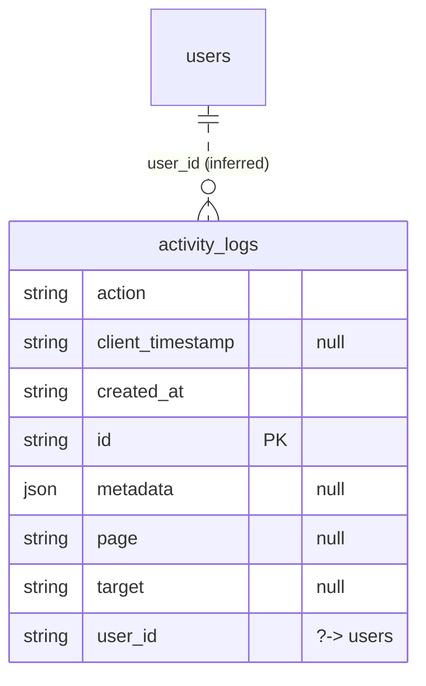

# Table: activity_logs

_Generated 2026-09-05 by `scripts/schema-map`. Do not edit by hand; run `npm run schema:map`._

[Back to overview](../README.md) · Domain: [users](../clusters/users.md)

- Primary key: `id`
- RLS: enabled
- Defined in: `types.ts`, `20260310210949_28c1bc29-366f-4335-9837-d9a9680f1773.sql`, `20260310214853_a8ce362e-7bfc-4443-8c5a-126cc2b4590b.sql`

## Columns

| Column | Type | Null | Keys | References |
| --- | --- | --- | --- | --- |
| `action` | string |  |  |  |
| `client_timestamp` | string | yes |  |  |
| `created_at` | string |  |  |  |
| `id` | string |  | PK |  |
| `metadata` | json | yes |  |  |
| `page` | string | yes |  |  |
| `target` | string | yes |  |  |
| `user_id` | string |  |  | [users](../tables/users.md).id (inferred) |

## Relationships

**References**

- [users](../tables/users.md) via `user_id` (many-to-one, **inferred**)

## Neighbourhood

## RLS policies

| Policy | Command | Roles | Using | With check | Calls | Source |
| --- | --- | --- | --- | --- | --- | --- |
| Authenticated users can insert activity logs | INSERT | authenticated |  | `auth.uid() = user_id` |  | `20260310210949_28c1bc29-366f-4335-9837-d9a9680f1773.sql` |
| Super admins can view activity logs | SELECT | authenticated | `public.is_super_admin(auth.uid())` |  | `is_super_admin` | `20260310210949_28c1bc29-366f-4335-9837-d9a9680f1773.sql` |

## Used by SQL

- function `purge_old_activity_logs()` (security definer)

## Used by code

_No direct queries found in code._
