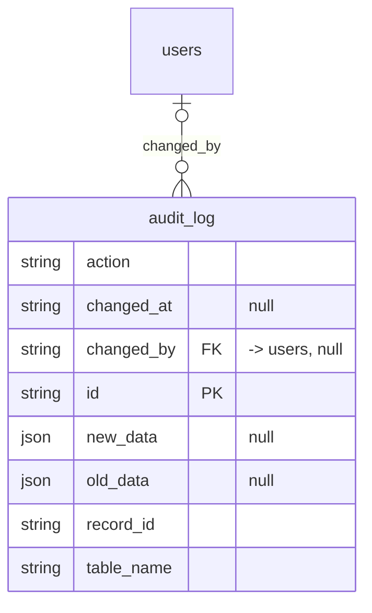

# Table: audit_log

_Generated 2026-09-07 by `scripts/schema-map`. Do not edit by hand; run `npm run schema:map`._

[Back to overview](../README.md) · Domain: [users](../clusters/users.md)

- Primary key: `id`
- RLS: enabled
- Defined in: `types.ts`, `20251031033503_58d57205-49cf-441e-bd45-c1d307483c5d.sql`

## Columns

| Column | Type | Null | Keys | References |
| --- | --- | --- | --- | --- |
| `action` | string |  |  |  |
| `changed_at` | string | yes |  |  |
| `changed_by` | string | yes | FK | [users](../tables/users.md).id |
| `id` | string |  | PK |  |
| `new_data` | json | yes |  |  |
| `old_data` | json | yes |  |  |
| `record_id` | string |  |  |  |
| `table_name` | string |  |  |  |

## Relationships

**References**

- [users](../tables/users.md) via `changed_by` (many-to-one, optional)

**Polymorphic**

- `table_name` + `record_id` can point at any table

## Neighbourhood

## RLS policies

| Policy | Command | Roles | Using | With check | Calls | Source |
| --- | --- | --- | --- | --- | --- | --- |
| Managers and admins can view audit logs | SELECT | authenticated | `EXISTS ( SELECT 1 FROM user_roles WHERE user_roles.user_id = auth.uid() AND user_roles.role IN ('manager', 'admin', 'su…` |  |  | `20251031033503_58d57205-49cf-441e-bd45-c1d307483c5d.sql` |
| System can insert audit logs | INSERT | authenticated |  | `true` |  | `20251031033503_58d57205-49cf-441e-bd45-c1d307483c5d.sql` |

## Used by SQL

- function `audit_wash_entries()` (security definer)
- function `audit_work_entries()` (security definer)

## Review notes

- **high** `permissions/adhoc-role-check`: This rule checks roles by hand instead of using the shared helpers (has_role_or_higher(), has_role(), is_super_admin()). If the role model changes, this one will be missed. `EXISTS ( SELECT 1 FROM user_roles WHERE user_roles.user_id = auth.uid() AND user_roles.role IN ('manager', 'admin', 'su…`

## Used by code

_No direct queries found in code._
