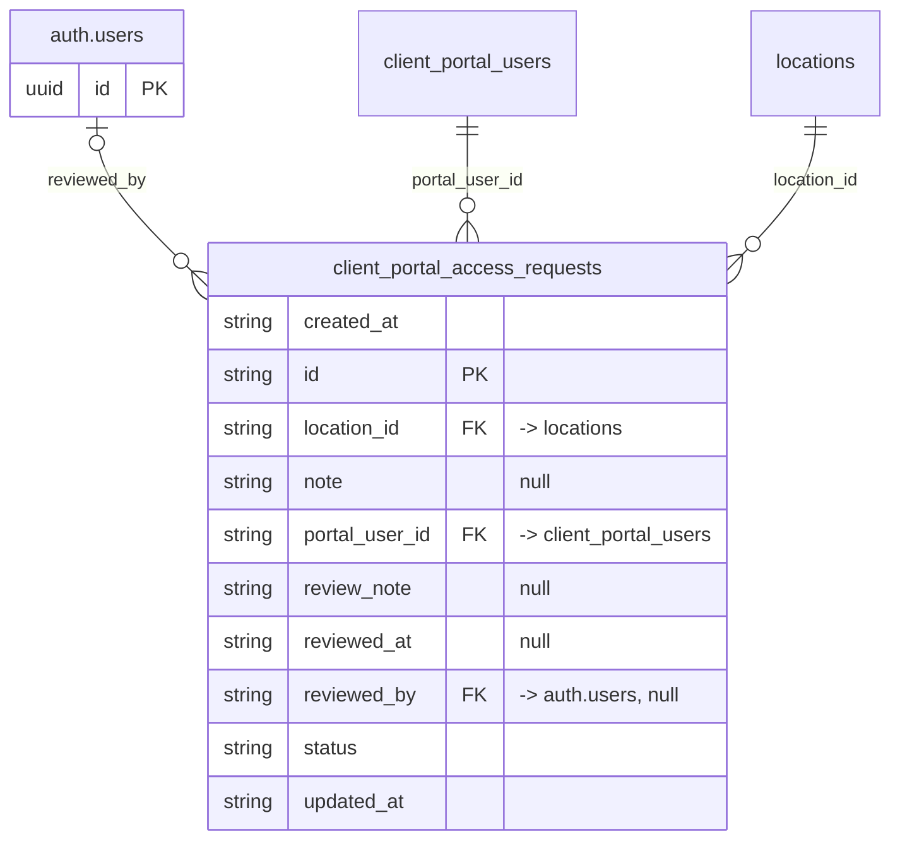

# Table: client_portal_access_requests

_Generated 2026-09-05 by `scripts/schema-map`. Do not edit by hand; run `npm run schema:map`._

[Back to overview](../README.md) · Domain: [client_portal_users](../clusters/client_portal_users.md)

- Primary key: `id`
- RLS: enabled
- Defined in: `types.ts`, `20260624214004_8a349c83-7751-43a6-8c27-1ece902bed41.sql`

## Columns

| Column | Type | Null | Keys | References |
| --- | --- | --- | --- | --- |
| `created_at` | string |  |  |  |
| `id` | string |  | PK |  |
| `location_id` | string |  | FK | [locations](../tables/locations.md).id |
| `note` | string | yes |  |  |
| `portal_user_id` | string |  | FK | [client_portal_users](../tables/client_portal_users.md).id |
| `review_note` | string | yes |  |  |
| `reviewed_at` | string | yes |  |  |
| `reviewed_by` | string | yes | FK | auth.users.id |
| `status` | string |  |  |  |
| `updated_at` | string |  |  |  |

## Relationships

**References**

- `auth.users` via `reviewed_by` (many-to-one, optional, other schema)
- [client_portal_users](../tables/client_portal_users.md) via `portal_user_id` (many-to-one)
- [locations](../tables/locations.md) via `location_id` (many-to-one)

## Neighbourhood

## RLS policies

| Policy | Command | Roles | Using | With check | Calls | Source |
| --- | --- | --- | --- | --- | --- | --- |
| Finance+ read all requests | SELECT | authenticated | `public.has_role_or_higher(auth.uid(), 'finance'::app_role)` |  | `has_role_or_higher` | `20260624214004_8a349c83-7751-43a6-8c27-1ece902bed41.sql` |
| Finance+ update requests | UPDATE | authenticated | `public.has_role_or_higher(auth.uid(), 'finance'::app_role)` |  | `has_role_or_higher` | `20260624214004_8a349c83-7751-43a6-8c27-1ece902bed41.sql` |
| Portal users create own requests | INSERT | authenticated | `` | `portal_user_id = public.get_portal_user_id(auth.uid()) AND status = 'pending' AND public.is_portal_approved(auth.uid())` | `get_portal_user_id`, `is_portal_approved` | `20260624221350_0abfecd5-51ce-493c-9711-b5544a85d673.sql` |
| Portal users read own requests | SELECT | authenticated | `portal_user_id = public.get_portal_user_id(auth.uid())` |  | `get_portal_user_id` | `20260624214004_8a349c83-7751-43a6-8c27-1ece902bed41.sql` |

## Triggers

| Trigger | When | Function | Function touches |
| --- | --- | --- | --- |
| `trg_client_portal_requests_updated` | BEFORE UPDATE FOR EACH ROW | `set_updated_at()` |  |

## Used by code

**Edge functions**

- `approve-portal-request`
- `delete-portal-user`

**Frontend**

- `src/hooks/usePendingPortalRequestCount.ts`
- `src/pages/admin/PortalRequests.tsx`
- `src/pages/portal/PortalRequestAccess.tsx`
