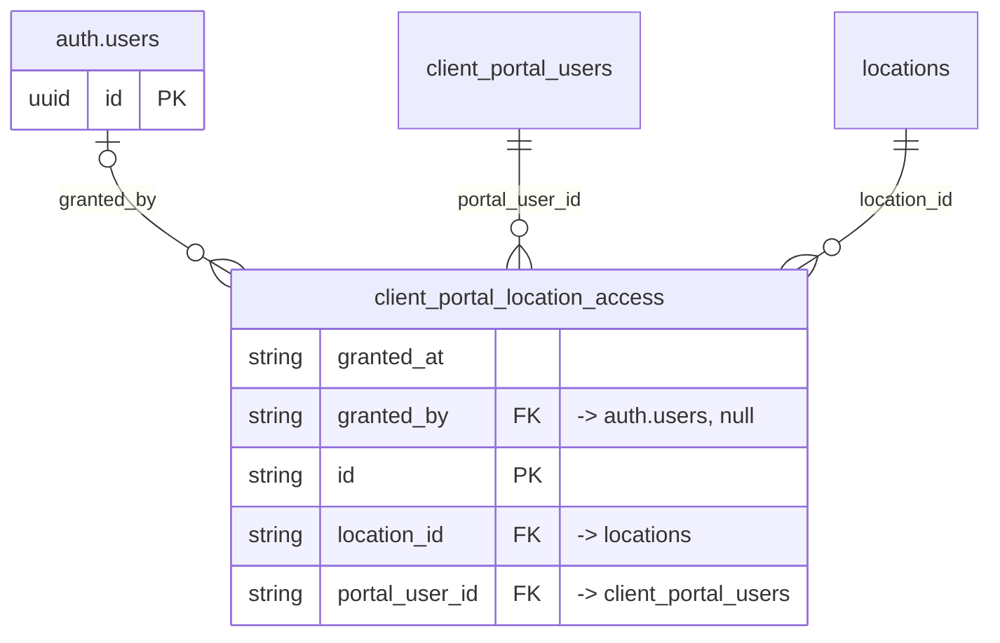

# Table: client_portal_location_access

_Generated 2026-09-05 by `scripts/schema-map`. Do not edit by hand; run `npm run schema:map`._

[Back to overview](../README.md) · Domain: [client_portal_users](../clusters/client_portal_users.md)

- Primary key: `id`
- Unique: `portal_user_id`, `location_id`
- RLS: enabled
- Junction table (many-to-many link)
- Defined in: `types.ts`, `20260624214004_8a349c83-7751-43a6-8c27-1ece902bed41.sql`

## Columns

| Column | Type | Null | Keys | References |
| --- | --- | --- | --- | --- |
| `granted_at` | string |  |  |  |
| `granted_by` | string | yes | FK | auth.users.id |
| `id` | string |  | PK |  |
| `location_id` | string |  | FK | [locations](../tables/locations.md).id |
| `portal_user_id` | string |  | FK | [client_portal_users](../tables/client_portal_users.md).id |

## Relationships

**References**

- `auth.users` via `granted_by` (many-to-one, optional, other schema)
- [client_portal_users](../tables/client_portal_users.md) via `portal_user_id` (many-to-one)
- [locations](../tables/locations.md) via `location_id` (many-to-one)

## Neighbourhood

## RLS policies

| Policy | Command | Roles | Using | With check | Calls | Source |
| --- | --- | --- | --- | --- | --- | --- |
| Finance+ manage grants | ALL | authenticated | `public.has_role_or_higher(auth.uid(), 'finance'::app_role)` | `public.has_role_or_higher(auth.uid(), 'finance'::app_role)` | `has_role_or_higher` | `20260624214004_8a349c83-7751-43a6-8c27-1ece902bed41.sql` |
| Finance+ read all grants | SELECT | authenticated | `public.has_role_or_higher(auth.uid(), 'finance'::app_role)` |  | `has_role_or_higher` | `20260624214004_8a349c83-7751-43a6-8c27-1ece902bed41.sql` |
| Portal users see own grants | SELECT | authenticated | `portal_user_id = public.get_portal_user_id(auth.uid())` |  | `get_portal_user_id` | `20260624214004_8a349c83-7751-43a6-8c27-1ece902bed41.sql` |

## Used by SQL

- function `get_portal_my_locations()` (security definer)
- function `portal_has_location()` (security definer)

## Used by code

**Edge functions**

- `approve-portal-request`
- `delete-portal-user`
- `set-portal-approval`

**Frontend**

- `src/pages/admin/PortalRequests.tsx`
- `src/pages/admin/PortalUsers.tsx`
