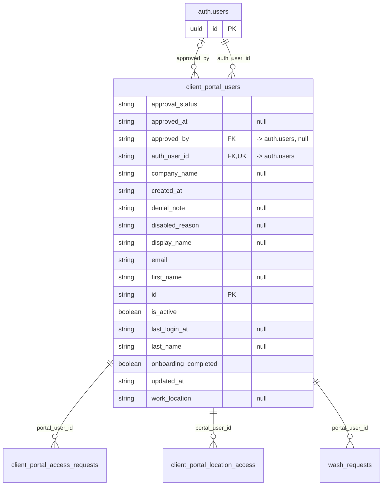

# Table: client_portal_users

_Generated 2026-09-07 by `scripts/schema-map`. Do not edit by hand; run `npm run schema:map`._

[Back to overview](../README.md) · Domain: [client_portal_users](../clusters/client_portal_users.md)

- Primary key: `id`
- Unique: `auth_user_id`
- RLS: enabled
- Defined in: `types.ts`, `20260624214004_8a349c83-7751-43a6-8c27-1ece902bed41.sql`, `20260624221350_0abfecd5-51ce-493c-9711-b5544a85d673.sql`, `20260624222425_a1723f5b-2533-4b78-9ecc-2e6dcb7e75a5.sql`

## Columns

| Column | Type | Null | Keys | References |
| --- | --- | --- | --- | --- |
| `approval_status` | string |  |  |  |
| `approved_at` | string | yes |  |  |
| `approved_by` | string | yes | FK | auth.users.id |
| `auth_user_id` | string |  | FK, UK | auth.users.id |
| `company_name` | string | yes |  |  |
| `created_at` | string |  |  |  |
| `denial_note` | string | yes |  |  |
| `disabled_reason` | string | yes |  |  |
| `display_name` | string | yes |  |  |
| `email` | string |  |  |  |
| `first_name` | string | yes |  |  |
| `id` | string |  | PK |  |
| `is_active` | boolean |  |  |  |
| `last_login_at` | string | yes |  |  |
| `last_name` | string | yes |  |  |
| `onboarding_completed` | boolean |  |  |  |
| `updated_at` | string |  |  |  |
| `work_location` | string | yes |  |  |

## Relationships

**References**

- `auth.users` via `approved_by` (many-to-one, optional, other schema)
- `auth.users` via `auth_user_id` (many-to-one, other schema)

**Referenced by**

- [client_portal_access_requests](../tables/client_portal_access_requests.md) via `client_portal_access_requests.portal_user_id` (one-to-many)
- [client_portal_location_access](../tables/client_portal_location_access.md) via `client_portal_location_access.portal_user_id` (one-to-many)
- [wash_requests](../tables/wash_requests.md) via `wash_requests.portal_user_id` (one-to-many)

**Many-to-many**

- [locations](../tables/locations.md) via [client_portal_location_access](../tables/client_portal_location_access.md)

## Neighbourhood

## RLS policies

| Policy | Command | Roles | Using | With check | Calls | Source |
| --- | --- | --- | --- | --- | --- | --- |
| Admin+ can delete portal users | DELETE | authenticated | `public.has_role_or_higher(auth.uid(), 'admin'::app_role)` |  | `has_role_or_higher` | `20260624214004_8a349c83-7751-43a6-8c27-1ece902bed41.sql` |
| Admin+ can insert portal users | INSERT | authenticated |  | `public.has_role_or_higher(auth.uid(), 'admin'::app_role)` | `has_role_or_higher` | `20260624214004_8a349c83-7751-43a6-8c27-1ece902bed41.sql` |
| Finance+ can read all portal users | SELECT | authenticated | `public.has_role_or_higher(auth.uid(), 'finance'::app_role)` |  | `has_role_or_higher` | `20260624214004_8a349c83-7751-43a6-8c27-1ece902bed41.sql` |
| Finance+ can update portal users | UPDATE | authenticated | `public.has_role_or_higher(auth.uid(), 'finance'::app_role)` |  | `has_role_or_higher` | `20260624214004_8a349c83-7751-43a6-8c27-1ece902bed41.sql` |
| Portal users can read own profile | SELECT | authenticated | `auth_user_id = auth.uid()` |  |  | `20260624214004_8a349c83-7751-43a6-8c27-1ece902bed41.sql` |

## Triggers

| Trigger | When | Function | Function touches |
| --- | --- | --- | --- |
| `trg_client_portal_users_updated` | BEFORE UPDATE FOR EACH ROW | `set_updated_at()` |  |

## Used by SQL

- function `disable_inactive_portal_users()` (security definer)
- function `get_portal_account_status()` (security definer)
- function `get_portal_my_locations()` (security definer)
- function `get_portal_user_id()` (security definer)
- function `get_portal_users_email_auth()` (security definer)
- function `is_portal_approved()` (security definer)
- function `is_portal_user()` (security definer)
- function `portal_has_location()` (security definer)

## Used by code

**Edge functions**

- `create-portal-user`
- `delete-portal-user`
- `ensure-portal-user`
- `record-portal-login`
- `send-portal-password-reset`
- `set-portal-approval`
- `submit-portal-onboarding`

**Frontend**

- `src/contexts/AuthContext.tsx`
- `src/hooks/usePendingPortalRequestCount.ts`
- `src/pages/Messages.tsx`
- `src/pages/admin/PortalRequests.tsx`
- `src/pages/admin/PortalUsers.tsx`
- `src/pages/portal/PortalRequestAccess.tsx`
- `src/pages/portal/PortalRequestWash.tsx`
