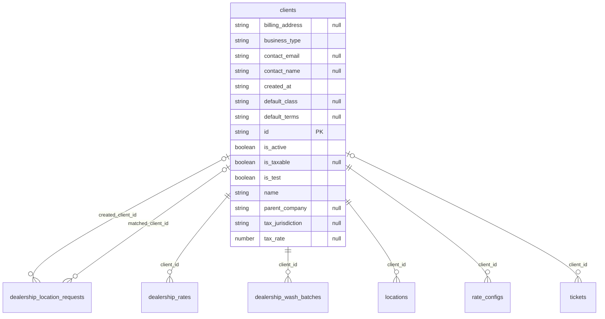

# Table: clients

_Generated 2026-09-05 by `scripts/schema-map`. Do not edit by hand; run `npm run schema:map`._

[Back to overview](../README.md) · Domain: [clients](../clusters/clients.md)

- Primary key: `id`
- RLS: enabled
- Defined in: `types.ts`, `20251228042616_f79cb89f-5d54-49ad-b578-1998519041dd.sql`, `20251229231957_ecd22cc5-63c9-4846-8e42-f794c6172471.sql`, `20260108215940_cf03ab88-8159-4c6b-81d3-9e3c3ddc82c5.sql`, `20260618054621_0b47f4fa-4cea-4f03-92ac-680a88e98bc8.sql`, `20260723214430_f0bd01c4-3310-4661-b254-c94ec0080a6e.sql`

## Columns

| Column | Type | Null | Keys | References |
| --- | --- | --- | --- | --- |
| `billing_address` | string | yes |  |  |
| `business_type` | string |  |  |  |
| `contact_email` | string | yes |  |  |
| `contact_name` | string | yes |  |  |
| `created_at` | string |  |  |  |
| `default_class` | string | yes |  |  |
| `default_terms` | string | yes |  |  |
| `id` | string |  | PK |  |
| `is_active` | boolean |  |  |  |
| `is_taxable` | boolean | yes |  |  |
| `is_test` | boolean |  |  |  |
| `name` | string |  |  |  |
| `parent_company` | string | yes |  |  |
| `tax_jurisdiction` | string | yes |  |  |
| `tax_rate` | number | yes |  |  |

## Relationships

**Referenced by**

- [dealership_location_requests](../tables/dealership_location_requests.md) via `dealership_location_requests.created_client_id` (one-to-many, optional)
- [dealership_location_requests](../tables/dealership_location_requests.md) via `dealership_location_requests.matched_client_id` (one-to-many, optional)
- [dealership_rates](../tables/dealership_rates.md) via `dealership_rates.client_id` (one-to-many)
- [dealership_wash_batches](../tables/dealership_wash_batches.md) via `dealership_wash_batches.client_id` (one-to-many)
- [locations](../tables/locations.md) via `locations.client_id` (one-to-many)
- [rate_configs](../tables/rate_configs.md) via `rate_configs.client_id` (one-to-many)
- [tickets](../tables/tickets.md) via `tickets.client_id` (one-to-many, optional)

## Neighbourhood

## RLS policies

| Policy | Command | Roles | Using | With check | Calls | Source |
| --- | --- | --- | --- | --- | --- | --- |
| Employees can view assigned clients | SELECT | public | `EXISTS ( SELECT 1 FROM public.locations l JOIN public.user_locations ul ON ul.location_id = l.id WHERE l.client_id = cl…` |  |  | `20251228042616_f79cb89f-5d54-49ad-b578-1998519041dd.sql` |
| Finance and admins can manage clients | ALL | public | `has_role_or_higher(auth.uid(), 'finance'::app_role)` | `has_role_or_higher(auth.uid(), 'finance'::app_role)` | `has_role_or_higher` | `20260108203209_c88d0e0a-5752-4578-8d40-2a7eb45622e2.sql` |
| Finance can view clients | SELECT | public | `has_role_or_higher(auth.uid(), 'finance'::app_role)` |  | `has_role_or_higher` | `20251228042616_f79cb89f-5d54-49ad-b578-1998519041dd.sql` |

## Used by SQL

- function `get_dealership_report_data()` (security definer)
- function `get_portal_my_locations()` (security definer)
- function `get_report_data()` (security definer)

## Used by code

**Frontend**

- `src/components/CSVImportModal.tsx`
- `src/components/ClientSetupWizard.tsx`
- `src/components/CreateClientInlineModal.tsx`
- `src/components/CreateLocationModal.tsx`
- `src/components/EditLocationModal.tsx`
- `src/components/LocationTable.tsx`
- `src/components/dealership/RequestDealershipLocationModal.tsx`
- `src/components/reports/ReportFilters.tsx`
- `src/components/tickets/SubmitTicketModal.tsx`
- `src/pages/AdminDashboard.tsx`
- `src/pages/Clients.tsx`
- `src/pages/FinanceThisWeek.tsx`
- `src/pages/RateCard.tsx`
- `src/pages/WorkItems.tsx`
- `src/pages/dealership/DealershipRates.tsx`
- `src/pages/dealership/DealershipRequests.tsx`
