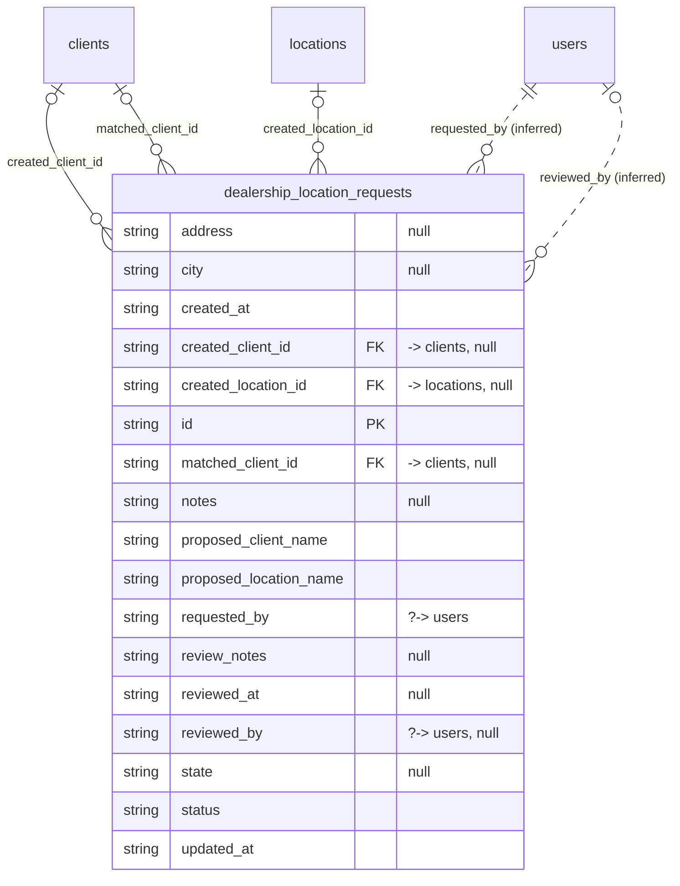

# Table: dealership_location_requests

_Generated 2026-09-07 by `scripts/schema-map`. Do not edit by hand; run `npm run schema:map`._

[Back to overview](../README.md) · Domain: [clients](../clusters/clients.md)

- Primary key: `id`
- RLS: enabled
- Defined in: `types.ts`, `20260618054621_0b47f4fa-4cea-4f03-92ac-680a88e98bc8.sql`

## Columns

| Column | Type | Null | Keys | References |
| --- | --- | --- | --- | --- |
| `address` | string | yes |  |  |
| `city` | string | yes |  |  |
| `created_at` | string |  |  |  |
| `created_client_id` | string | yes | FK | [clients](../tables/clients.md).id |
| `created_location_id` | string | yes | FK | [locations](../tables/locations.md).id |
| `id` | string |  | PK |  |
| `matched_client_id` | string | yes | FK | [clients](../tables/clients.md).id |
| `notes` | string | yes |  |  |
| `proposed_client_name` | string |  |  |  |
| `proposed_location_name` | string |  |  |  |
| `requested_by` | string |  |  | [users](../tables/users.md).id (inferred) |
| `review_notes` | string | yes |  |  |
| `reviewed_at` | string | yes |  |  |
| `reviewed_by` | string | yes |  | [users](../tables/users.md).id (inferred) |
| `state` | string | yes |  |  |
| `status` | string |  |  |  |
| `updated_at` | string |  |  |  |

## Relationships

**References**

- [clients](../tables/clients.md) via `created_client_id` (many-to-one, optional)
- [clients](../tables/clients.md) via `matched_client_id` (many-to-one, optional)
- [locations](../tables/locations.md) via `created_location_id` (many-to-one, optional)
- [users](../tables/users.md) via `requested_by` (many-to-one, **inferred**)
- [users](../tables/users.md) via `reviewed_by` (many-to-one, optional, **inferred**)

## Neighbourhood

## RLS policies

| Policy | Command | Roles | Using | With check | Calls | Source |
| --- | --- | --- | --- | --- | --- | --- |
| Admin delete requests | DELETE | authenticated | `public.has_role_or_higher(auth.uid(), 'admin'::app_role)` |  | `has_role_or_higher` | `20260618054621_0b47f4fa-4cea-4f03-92ac-680a88e98bc8.sql` |
| Finance+ review requests | UPDATE | authenticated | `public.has_role_or_higher(auth.uid(), 'finance'::app_role)` |  | `has_role_or_higher` | `20260618054621_0b47f4fa-4cea-4f03-92ac-680a88e98bc8.sql` |
| Users create their own requests | INSERT | authenticated |  | `requested_by = auth.uid()` |  | `20260618054621_0b47f4fa-4cea-4f03-92ac-680a88e98bc8.sql` |
| Users view own requests; finance+ all | SELECT | authenticated | `requested_by = auth.uid() OR public.has_role_or_higher(auth.uid(), 'finance'::app_role)` |  | `has_role_or_higher` | `20260618054621_0b47f4fa-4cea-4f03-92ac-680a88e98bc8.sql` |

## Triggers

| Trigger | When | Function | Function touches |
| --- | --- | --- | --- |
| `trg_dealership_requests_updated` | BEFORE UPDATE FOR EACH ROW | `set_updated_at()` |  |

## Used by code

_No direct queries found in code._
