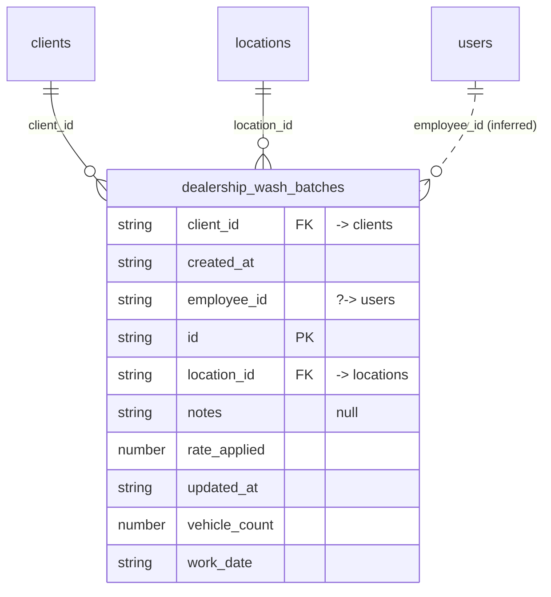

# Table: dealership_wash_batches

_Generated 2026-09-07 by `scripts/schema-map`. Do not edit by hand; run `npm run schema:map`._

[Back to overview](../README.md) · Domain: [clients](../clusters/clients.md)

- Primary key: `id`
- Unique: `location_id`, `employee_id`, `work_date`
- RLS: enabled
- Defined in: `types.ts`, `20260618054621_0b47f4fa-4cea-4f03-92ac-680a88e98bc8.sql`

## Columns

| Column | Type | Null | Keys | References |
| --- | --- | --- | --- | --- |
| `client_id` | string |  | FK | [clients](../tables/clients.md).id |
| `created_at` | string |  |  |  |
| `employee_id` | string |  |  | [users](../tables/users.md).id (inferred) |
| `id` | string |  | PK |  |
| `location_id` | string |  | FK | [locations](../tables/locations.md).id |
| `notes` | string | yes |  |  |
| `rate_applied` | number |  |  |  |
| `updated_at` | string |  |  |  |
| `vehicle_count` | number |  |  |  |
| `work_date` | string |  |  |  |

## Relationships

**References**

- [clients](../tables/clients.md) via `client_id` (many-to-one)
- [locations](../tables/locations.md) via `location_id` (many-to-one)
- [users](../tables/users.md) via `employee_id` (many-to-one, **inferred**)

## Neighbourhood

## RLS policies

| Policy | Command | Roles | Using | With check | Calls | Source |
| --- | --- | --- | --- | --- | --- | --- |
| Admin delete batches | DELETE | authenticated | `public.has_role_or_higher(auth.uid(), 'admin'::app_role) OR (employee_id = auth.uid() AND work_date = CURRENT_DATE)` |  | `has_role_or_higher` | `20260618054621_0b47f4fa-4cea-4f03-92ac-680a88e98bc8.sql` |
| Employees insert their own batches | INSERT | authenticated |  | `employee_id = auth.uid() AND ( public.has_role_or_higher(auth.uid(), 'finance'::app_role) OR EXISTS ( SELECT 1 FROM pub…` | `has_role_or_higher` | `20260618054621_0b47f4fa-4cea-4f03-92ac-680a88e98bc8.sql` |
| Employees update their own same-day batches; finance any | UPDATE | authenticated | `public.has_role_or_higher(auth.uid(), 'finance'::app_role) OR (employee_id = auth.uid() AND work_date = CURRENT_DATE)` |  | `has_role_or_higher` | `20260618054621_0b47f4fa-4cea-4f03-92ac-680a88e98bc8.sql` |
| Employees view batches at assigned locations | SELECT | authenticated | `public.has_role_or_higher(auth.uid(), 'finance'::app_role) OR EXISTS ( SELECT 1 FROM public.user_locations ul WHERE ul.…` |  | `has_role_or_higher` | `20260618054621_0b47f4fa-4cea-4f03-92ac-680a88e98bc8.sql` |

## Triggers

| Trigger | When | Function | Function touches |
| --- | --- | --- | --- |
| `trg_dealership_batches_updated` | BEFORE UPDATE FOR EACH ROW | `set_updated_at()` |  |

## Used by SQL

- function `get_dealership_report_data()` (security definer)
- function `get_portal_dealership_history()` (security definer)

## Review notes

- **low** `connectedness/loose-links`: 1 link exist only by column name; the database does not enforce them, so deleting the target leaves dangling references. `employee_id → users`

## Used by code

_No direct queries found in code._
