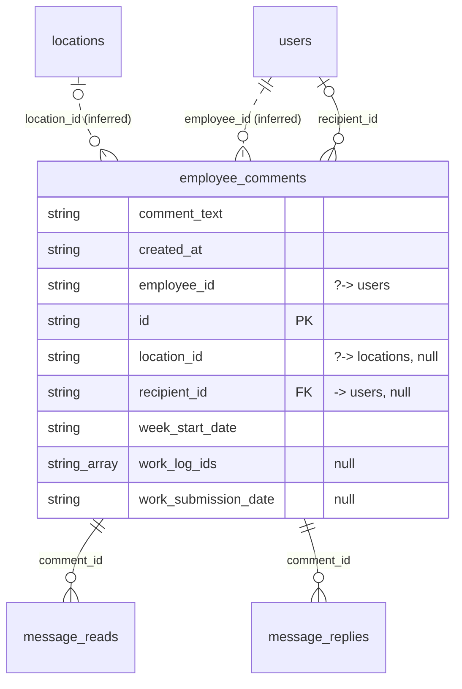

# Table: employee_comments

_Generated 2026-09-05 by `scripts/schema-map`. Do not edit by hand; run `npm run schema:map`._

[Back to overview](../README.md) · Domain: [employee_comments](../clusters/employee_comments.md)

- Primary key: `id`
- RLS: enabled
- Defined in: `types.ts`, `20251217031039_086af497-57d4-4e77-8026-d4bb66ec130a.sql`, `20260109043508_3f6bd463-8978-4b52-8137-845a20913526.sql`, `20260109060125_9aee50fc-c703-4bc1-8517-44b03272d665.sql`, `20260624230640_a3a3ff53-52e4-4d46-9600-fb25c5842286.sql`

## Columns

| Column | Type | Null | Keys | References |
| --- | --- | --- | --- | --- |
| `comment_text` | string |  |  |  |
| `created_at` | string |  |  |  |
| `employee_id` | string |  |  | [users](../tables/users.md).id (inferred) |
| `id` | string |  | PK |  |
| `location_id` | string | yes |  | [locations](../tables/locations.md).id (inferred) |
| `recipient_id` | string | yes | FK | [users](../tables/users.md).id |
| `week_start_date` | string |  |  |  |
| `work_log_ids` | string_array | yes |  |  |
| `work_submission_date` | string | yes |  |  |

## Relationships

**References**

- [locations](../tables/locations.md) via `location_id` (many-to-one, optional, **inferred**)
- [users](../tables/users.md) via `employee_id` (many-to-one, **inferred**)
- [users](../tables/users.md) via `recipient_id` (many-to-one, optional)

**Referenced by**

- [message_reads](../tables/message_reads.md) via `message_reads.comment_id` (one-to-many)
- [message_replies](../tables/message_replies.md) via `message_replies.comment_id` (one-to-many)

**Many-to-many**

- [users](../tables/users.md) via [message_reads](../tables/message_reads.md)

## Neighbourhood

## RLS policies

| Policy | Command | Roles | Using | With check | Calls | Source |
| --- | --- | --- | --- | --- | --- | --- |
| Employees can insert their own comments | INSERT | public |  | `auth.uid() = employee_id` |  | `20251217031039_086af497-57d4-4e77-8026-d4bb66ec130a.sql` |
| Employees can view their own comments | SELECT | public | `auth.uid() = employee_id` |  |  | `20251217031039_086af497-57d4-4e77-8026-d4bb66ec130a.sql` |
| Finance and admin can view all comments | SELECT | public | `has_role_or_higher(auth.uid(), 'finance'::app_role)` |  | `has_role_or_higher` | `20251217031039_086af497-57d4-4e77-8026-d4bb66ec130a.sql` |
| Recipients can view comments addressed to them | SELECT | authenticated | `auth.uid() = recipient_id` |  |  | `20260622204626_3f53ed03-431a-4cfe-b447-e25d0cba1298.sql` |

## Used by SQL

- policy "Comment authors can reply to their own conversation" on [message_replies](../tables/message_replies.md)
- policy "Employees can view replies to their comments" on [message_replies](../tables/message_replies.md)

## Used by code

**Frontend**

- `src/components/EmployeeCommentSection.tsx`
- `src/hooks/useUnreadMessageCount.ts`
- `src/pages/EmployeeDashboard.tsx`
- `src/pages/Messages.tsx`
- `src/pages/portal/PortalMessages.tsx`
- `src/pages/portal/PortalRequestWash.tsx`
