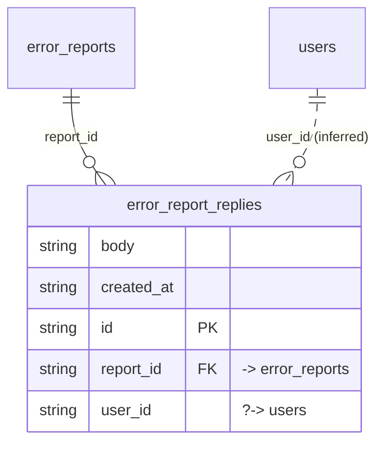

# Table: error_report_replies

_Generated 2026-09-07 by `scripts/schema-map`. Do not edit by hand; run `npm run schema:map`._

[Back to overview](../README.md) · Domain: [error_reports](../clusters/error_reports.md)

- Primary key: `id`
- RLS: enabled
- Defined in: `types.ts`, `20260622231126_8bdc1f64-efcd-40a1-bc50-9c17cc5f8686.sql`

## Columns

| Column | Type | Null | Keys | References |
| --- | --- | --- | --- | --- |
| `body` | string |  |  |  |
| `created_at` | string |  |  |  |
| `id` | string |  | PK |  |
| `report_id` | string |  | FK | [error_reports](../tables/error_reports.md).id |
| `user_id` | string |  |  | [users](../tables/users.md).id (inferred) |

## Relationships

**References**

- [error_reports](../tables/error_reports.md) via `report_id` (many-to-one)
- [users](../tables/users.md) via `user_id` (many-to-one, **inferred**)

## Neighbourhood

## RLS policies

| Policy | Command | Roles | Using | With check | Calls | Source |
| --- | --- | --- | --- | --- | --- | --- |
| Reporter or super admin can insert replies | INSERT | authenticated |  | `user_id = auth.uid() AND ( EXISTS (SELECT 1 FROM public.error_reports er WHERE er.id = report_id AND er.reported_by = a…` | `is_super_admin` | `20260622231126_8bdc1f64-efcd-40a1-bc50-9c17cc5f8686.sql` |
| Reporter or super admin can view replies | SELECT | authenticated | `EXISTS (SELECT 1 FROM public.error_reports er WHERE er.id = report_id AND er.reported_by = auth.uid()) OR public.is_sup…` |  | `is_super_admin` | `20260622231126_8bdc1f64-efcd-40a1-bc50-9c17cc5f8686.sql` |

## Review notes

- **low** `connectedness/lookalike-tables`: These two tables share 67% of their columns. Check whether one duplicates the other's purpose. `body, created_at, id, user_id`
- **low** `connectedness/loose-links`: 1 link exist only by column name; the database does not enforce them, so deleting the target leaves dangling references. `user_id → users`

## Used by code

**Frontend**

- `src/components/MyErrorReports.tsx`
- `src/hooks/usePortalUnreadCount.ts`
- `src/pages/AdminDashboard.tsx`
