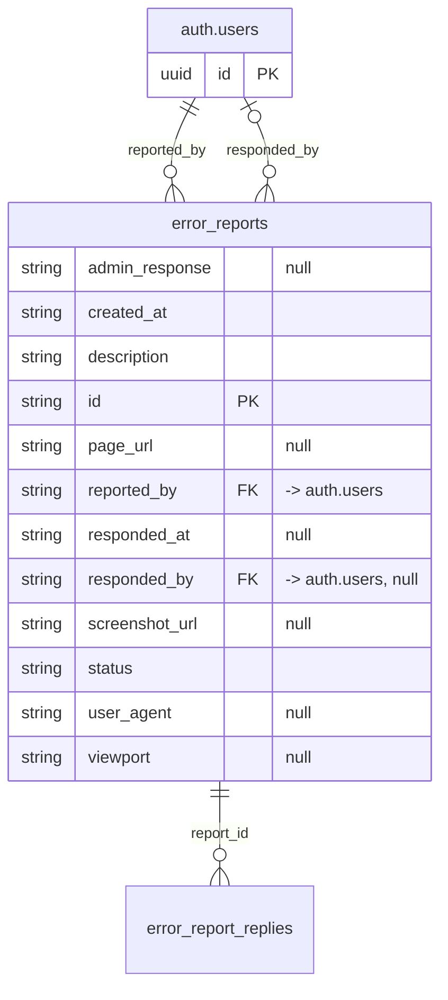

# Table: error_reports

_Generated 2026-09-07 by `scripts/schema-map`. Do not edit by hand; run `npm run schema:map`._

[Back to overview](../README.md) · Domain: [error_reports](../clusters/error_reports.md)

- Primary key: `id`
- RLS: enabled
- Defined in: `types.ts`, `20260313014212_8a0207b7-bd1b-4f31-b5c6-f2fcacb6b034.sql`, `20260622204626_3f53ed03-431a-4cfe-b447-e25d0cba1298.sql`

## Columns

| Column | Type | Null | Keys | References |
| --- | --- | --- | --- | --- |
| `admin_response` | string | yes |  |  |
| `created_at` | string |  |  |  |
| `description` | string |  |  |  |
| `id` | string |  | PK |  |
| `page_url` | string | yes |  |  |
| `reported_by` | string |  | FK | auth.users.id |
| `responded_at` | string | yes |  |  |
| `responded_by` | string | yes | FK | auth.users.id |
| `screenshot_url` | string | yes |  |  |
| `status` | string |  |  |  |
| `user_agent` | string | yes |  |  |
| `viewport` | string | yes |  |  |

## Relationships

**References**

- `auth.users` via `reported_by` (many-to-one, other schema)
- `auth.users` via `responded_by` (many-to-one, optional, other schema)

**Referenced by**

- [error_report_replies](../tables/error_report_replies.md) via `error_report_replies.report_id` (one-to-many)

## Neighbourhood

## RLS policies

| Policy | Command | Roles | Using | With check | Calls | Source |
| --- | --- | --- | --- | --- | --- | --- |
| Super admins can read all reports | SELECT | authenticated | `is_super_admin(auth.uid())` |  | `is_super_admin` | `20260313014212_8a0207b7-bd1b-4f31-b5c6-f2fcacb6b034.sql` |
| Super admins can update reports | UPDATE | authenticated | `is_super_admin(auth.uid())` |  | `is_super_admin` | `20260313014212_8a0207b7-bd1b-4f31-b5c6-f2fcacb6b034.sql` |
| Users can insert own reports | INSERT | authenticated |  | `auth.uid() = reported_by` |  | `20260313014212_8a0207b7-bd1b-4f31-b5c6-f2fcacb6b034.sql` |
| Users can read own reports | SELECT | authenticated | `auth.uid() = reported_by` |  |  | `20260313014212_8a0207b7-bd1b-4f31-b5c6-f2fcacb6b034.sql` |

## Used by SQL

- policy "Reporter or super admin can insert replies" on [error_report_replies](../tables/error_report_replies.md)
- policy "Reporter or super admin can view replies" on [error_report_replies](../tables/error_report_replies.md)

## Used by code

**Edge functions**

- `send-error-report-email`

**Frontend**

- `src/components/ErrorReportButton.tsx`
- `src/components/MyErrorReports.tsx`
- `src/pages/AdminDashboard.tsx`
