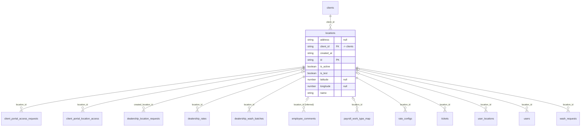

# Table: locations

_Generated 2026-09-05 by `scripts/schema-map`. Do not edit by hand; run `npm run schema:map`._

[Back to overview](../README.md) · Domain: [locations](../clusters/locations.md)

- Primary key: `id`
- RLS: enabled
- Hub table: referenced by 11 other tables
- Defined in: `types.ts`, `20251228042616_f79cb89f-5d54-49ad-b578-1998519041dd.sql`, `20260723175015_5fd9cddd-4411-4141-9ce3-ba43f3870dad.sql`, `20260723214430_f0bd01c4-3310-4661-b254-c94ec0080a6e.sql`

## Columns

| Column | Type | Null | Keys | References |
| --- | --- | --- | --- | --- |
| `address` | string | yes |  |  |
| `client_id` | string |  | FK | [clients](../tables/clients.md).id |
| `created_at` | string |  |  |  |
| `id` | string |  | PK |  |
| `is_active` | boolean |  |  |  |
| `is_test` | boolean |  |  |  |
| `latitude` | number | yes |  |  |
| `longitude` | number | yes |  |  |
| `name` | string |  |  |  |

## Relationships

**References**

- [clients](../tables/clients.md) via `client_id` (many-to-one)

**Referenced by**

- [client_portal_access_requests](../tables/client_portal_access_requests.md) via `client_portal_access_requests.location_id` (one-to-many)
- [client_portal_location_access](../tables/client_portal_location_access.md) via `client_portal_location_access.location_id` (one-to-many)
- [dealership_location_requests](../tables/dealership_location_requests.md) via `dealership_location_requests.created_location_id` (one-to-many, optional)
- [dealership_rates](../tables/dealership_rates.md) via `dealership_rates.location_id` (one-to-many, optional)
- [dealership_wash_batches](../tables/dealership_wash_batches.md) via `dealership_wash_batches.location_id` (one-to-many)
- [employee_comments](../tables/employee_comments.md) via `employee_comments.location_id` (one-to-many, optional, **inferred**)
- [payroll_work_type_map](../tables/payroll_work_type_map.md) via `payroll_work_type_map.location_id` (one-to-many, optional)
- [rate_configs](../tables/rate_configs.md) via `rate_configs.location_id` (one-to-many)
- [tickets](../tables/tickets.md) via `tickets.location_id` (one-to-many, optional)
- [user_locations](../tables/user_locations.md) via `user_locations.location_id` (one-to-many)
- [users](../tables/users.md) via `users.location_id` (one-to-many, optional)
- [wash_requests](../tables/wash_requests.md) via `wash_requests.location_id` (one-to-many)

**Many-to-many**

- [client_portal_users](../tables/client_portal_users.md) via [client_portal_location_access](../tables/client_portal_location_access.md)
- [users](../tables/users.md) via [user_locations](../tables/user_locations.md)

## Neighbourhood

## RLS policies

| Policy | Command | Roles | Using | With check | Calls | Source |
| --- | --- | --- | --- | --- | --- | --- |
| Employees can view assigned locations | SELECT | public | `EXISTS ( SELECT 1 FROM public.user_locations ul WHERE ul.location_id = locations.id AND ul.user_id = auth.uid() )` |  |  | `20251228042616_f79cb89f-5d54-49ad-b578-1998519041dd.sql` |
| Finance and admins can manage locations | ALL | public | `has_role_or_higher(auth.uid(), 'finance'::app_role)` | `has_role_or_higher(auth.uid(), 'finance'::app_role)` | `has_role_or_higher` | `20260108203209_c88d0e0a-5752-4578-8d40-2a7eb45622e2.sql` |
| Finance can view locations | SELECT | public | `has_role_or_higher(auth.uid(), 'finance'::app_role)` |  | `has_role_or_higher` | `20251228042616_f79cb89f-5d54-49ad-b578-1998519041dd.sql` |
| Portal users can view their accessible locations | SELECT | authenticated | `public.portal_has_location(auth.uid(), id)` |  | `portal_has_location` | `20260624230327_b7e4e762-807e-4efe-b78e-bd0edcf51f48.sql` |

## Triggers

| Trigger | When | Function | Function touches |
| --- | --- | --- | --- |
| `trg_assign_admins_to_new_location` | AFTER INSERT FOR EACH ROW | `assign_admins_to_new_location()` | [user_locations](../tables/user_locations.md), [user_roles](../tables/user_roles.md) |

## Used by SQL

- function `assign_all_locations_to_new_admin()` (security definer)
- function `get_dealership_report_data()` (security definer)
- function `get_portal_my_locations()` (security definer)
- function `get_report_data()` (security definer)
- policy "Employees can view assigned clients" on [clients](../tables/clients.md)

## Used by code

**Frontend**

- `src/components/CSVImportModal.tsx`
- `src/components/ClientSetupWizard.tsx`
- `src/components/CreateLocationInlineModal.tsx`
- `src/components/CreateLocationModal.tsx`
- `src/components/CreateUserModal.tsx`
- `src/components/EditLocationModal.tsx`
- `src/components/EditUserModal.tsx`
- `src/components/dealership/DealershipWashCard.tsx`
- `src/components/dealership/RequestDealershipLocationModal.tsx`
- `src/components/reports/ReportFilters.tsx`
- `src/components/tickets/SubmitTicketModal.tsx`
- `src/contexts/AuthContext.tsx`
- `src/pages/AdminDashboard.tsx`
- `src/pages/CreateUser.tsx`
- `src/pages/EmployeeDashboard.tsx`
- `src/pages/FinanceThisWeek.tsx`
- `src/pages/Locations.tsx`
- `src/pages/Messages.tsx`
- `src/pages/RateCard.tsx`
- `src/pages/Users.tsx`
- `src/pages/WorkItems.tsx`
- `src/pages/admin/PortalRequests.tsx`
- `src/pages/admin/PortalUsers.tsx`
- `src/pages/dealership/DealershipRates.tsx`
- `src/pages/dealership/DealershipRequests.tsx`
- `src/pages/portal/PortalRequestAccess.tsx`
