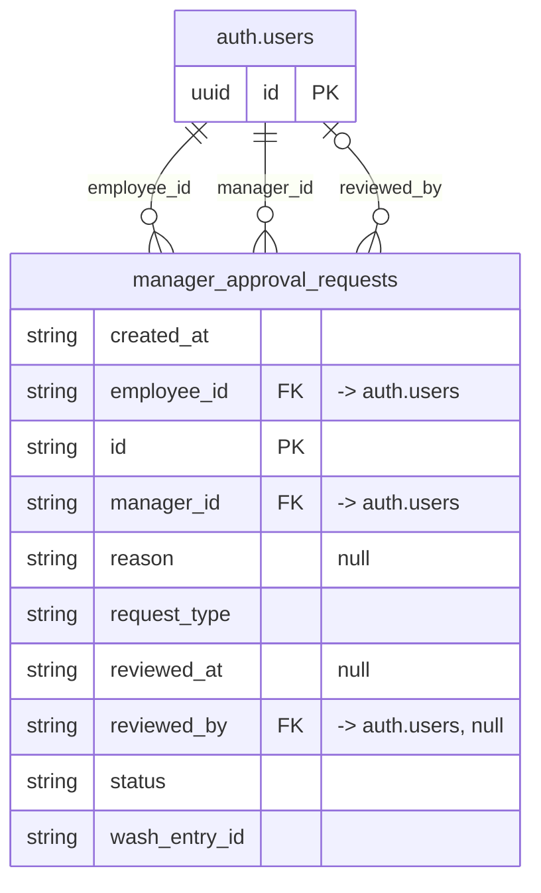

# Table: manager_approval_requests

_Generated 2026-09-07 by `scripts/schema-map`. Do not edit by hand; run `npm run schema:map`._

[Back to overview](../README.md) · Domain: [auth.users](../clusters/auth_users.md)

- Primary key: `id`
- RLS: enabled
- Defined in: `types.ts`, `20251030043513_4d19a151-b457-4873-802e-d5655eabb411.sql`

## Columns

| Column | Type | Null | Keys | References |
| --- | --- | --- | --- | --- |
| `created_at` | string |  |  |  |
| `employee_id` | string |  | FK | auth.users.id |
| `id` | string |  | PK |  |
| `manager_id` | string |  | FK | auth.users.id |
| `reason` | string | yes |  |  |
| `request_type` | string |  |  |  |
| `reviewed_at` | string | yes |  |  |
| `reviewed_by` | string | yes | FK | auth.users.id |
| `status` | string |  |  |  |
| `wash_entry_id` | string |  |  |  |

## Relationships

**References**

- `auth.users` via `employee_id` (many-to-one, other schema)
- `auth.users` via `manager_id` (many-to-one, other schema)
- `auth.users` via `reviewed_by` (many-to-one, optional, other schema)

## Neighbourhood

## RLS policies

| Policy | Command | Roles | Using | With check | Calls | Source |
| --- | --- | --- | --- | --- | --- | --- |
| Admins can view all approval requests | SELECT | public | `has_role(auth.uid(), 'admin'::app_role)` |  | `has_role` | `20251030043513_4d19a151-b457-4873-802e-d5655eabb411.sql` |
| Employees can create approval requests | INSERT | public |  | `auth.uid() = employee_id` |  | `20251030043513_4d19a151-b457-4873-802e-d5655eabb411.sql` |
| Employees can view own approval requests | SELECT | public | `auth.uid() = employee_id` |  |  | `20251030043513_4d19a151-b457-4873-802e-d5655eabb411.sql` |
| Managers can update assigned requests | UPDATE | public | `auth.uid() = manager_id AND status = 'pending'` |  |  | `20251030043513_4d19a151-b457-4873-802e-d5655eabb411.sql` |
| Managers can view assigned requests | SELECT | public | `auth.uid() = manager_id AND status = 'pending'` |  |  | `20251030043513_4d19a151-b457-4873-802e-d5655eabb411.sql` |

## Review notes

- **medium** `connectedness/unused-table`: No page, edge function, database function, rule or automatic action reads or writes this table. It may be dead, or something was built but never wired up.

## Used by code

_No direct queries found in code._
