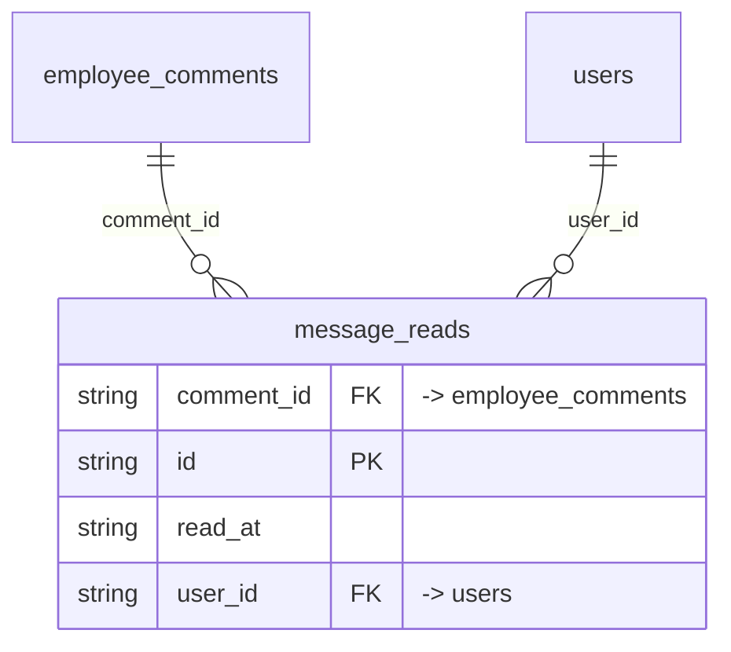

# Table: message_reads

_Generated 2026-09-05 by `scripts/schema-map`. Do not edit by hand; run `npm run schema:map`._

[Back to overview](../README.md) · Domain: [employee_comments](../clusters/employee_comments.md)

- Primary key: `id`
- Unique: `comment_id`, `user_id`
- RLS: enabled
- Junction table (many-to-many link)
- Defined in: `types.ts`, `20251217032059_aa58817a-37c0-4ae8-a633-31519c9ace20.sql`

## Columns

| Column | Type | Null | Keys | References |
| --- | --- | --- | --- | --- |
| `comment_id` | string |  | FK | [employee_comments](../tables/employee_comments.md).id |
| `id` | string |  | PK |  |
| `read_at` | string |  |  |  |
| `user_id` | string |  | FK | [users](../tables/users.md).id |

## Relationships

**References**

- [employee_comments](../tables/employee_comments.md) via `comment_id` (many-to-one)
- [users](../tables/users.md) via `user_id` (many-to-one)

## Neighbourhood

## RLS policies

| Policy | Command | Roles | Using | With check | Calls | Source |
| --- | --- | --- | --- | --- | --- | --- |
| Finance and admin can view message reads | SELECT | public | `has_role_or_higher(auth.uid(), 'finance'::app_role)` |  | `has_role_or_higher` | `20251217032059_aa58817a-37c0-4ae8-a633-31519c9ace20.sql` |
| Users can mark messages as read | INSERT | public | `` | `auth.uid() = user_id AND has_role_or_higher(auth.uid(), 'finance'::app_role)` | `has_role_or_higher` | `20251217032059_aa58817a-37c0-4ae8-a633-31519c9ace20.sql` |

## Used by code

**Frontend**

- `src/pages/Messages.tsx`
