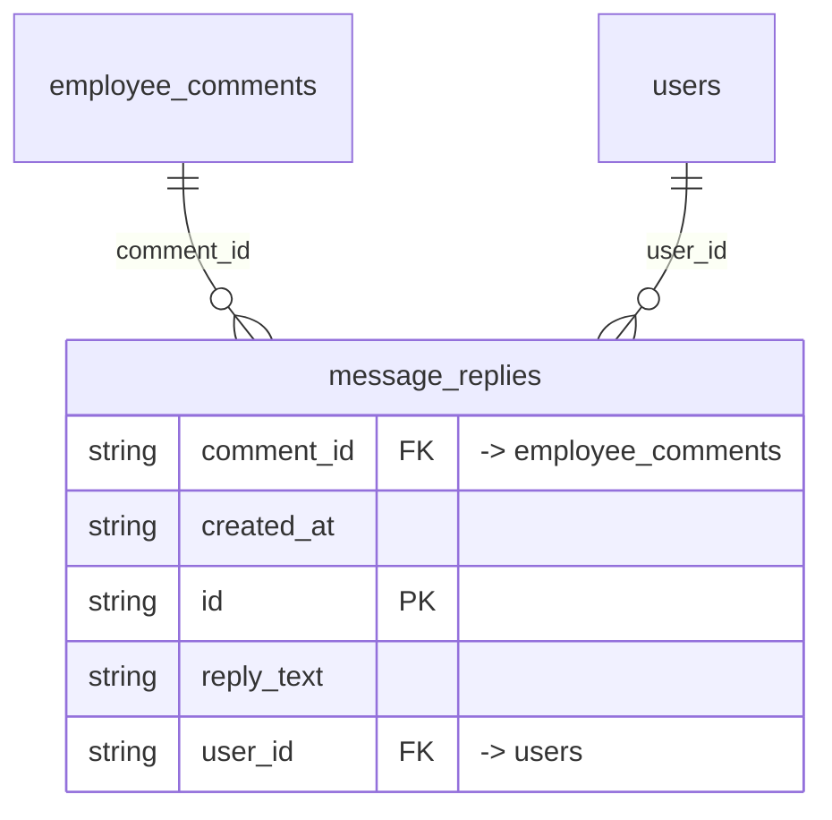

# Table: message_replies

_Generated 2026-09-05 by `scripts/schema-map`. Do not edit by hand; run `npm run schema:map`._

[Back to overview](../README.md) · Domain: [employee_comments](../clusters/employee_comments.md)

- Primary key: `id`
- RLS: enabled
- Defined in: `types.ts`, `20251217032444_4cf9552a-2788-4f9d-ba32-6be214171a9c.sql`

## Columns

| Column | Type | Null | Keys | References |
| --- | --- | --- | --- | --- |
| `comment_id` | string |  | FK | [employee_comments](../tables/employee_comments.md).id |
| `created_at` | string |  |  |  |
| `id` | string |  | PK |  |
| `reply_text` | string |  |  |  |
| `user_id` | string |  | FK | [users](../tables/users.md).id |

## Relationships

**References**

- [employee_comments](../tables/employee_comments.md) via `comment_id` (many-to-one)
- [users](../tables/users.md) via `user_id` (many-to-one)

## Neighbourhood

## RLS policies

| Policy | Command | Roles | Using | With check | Calls | Source |
| --- | --- | --- | --- | --- | --- | --- |
| Comment authors can reply to their own conversation | INSERT | authenticated | `` | `auth.uid() = user_id AND EXISTS (SELECT 1 FROM public.employee_comments ec WHERE ec.id = message_replies.comment_id AND…` |  | `20260624231142_c6f1b880-4b52-4314-aff7-504efcba81aa.sql` |
| Employees can view replies to their comments | SELECT | public | `EXISTS ( SELECT 1 FROM employee_comments ec WHERE ec.id = comment_id AND ec.employee_id = auth.uid() )` |  |  | `20251217032444_4cf9552a-2788-4f9d-ba32-6be214171a9c.sql` |
| Finance and admin can insert replies | INSERT | public | `` | `has_role_or_higher(auth.uid(), 'finance'::app_role)` | `has_role_or_higher` | `20251217032444_4cf9552a-2788-4f9d-ba32-6be214171a9c.sql` |
| Finance and admin can view all replies | SELECT | public | `has_role_or_higher(auth.uid(), 'finance'::app_role)` |  | `has_role_or_higher` | `20251217032444_4cf9552a-2788-4f9d-ba32-6be214171a9c.sql` |

## Used by code

**Frontend**

- `src/components/EmployeeCommentSection.tsx`
- `src/hooks/usePortalUnreadCount.ts`
- `src/pages/EmployeeDashboard.tsx`
- `src/pages/Messages.tsx`
- `src/pages/portal/PortalMessages.tsx`
