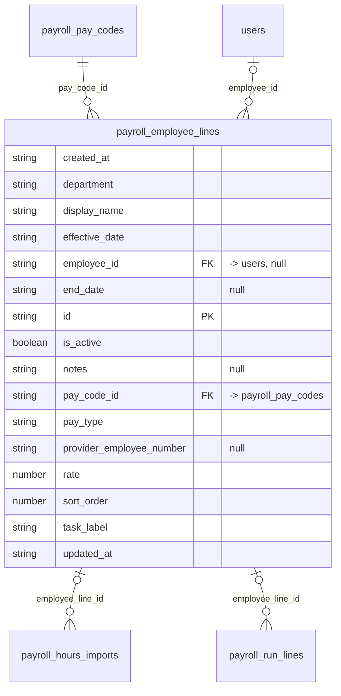

# Table: payroll_employee_lines

_Generated 2026-09-05 by `scripts/schema-map`. Do not edit by hand; run `npm run schema:map`._

[Back to overview](../README.md) · Domain: [payroll_employee_lines](../clusters/payroll_employee_lines.md)

- Primary key: `id`
- RLS: enabled
- Defined in: `types.ts`, `20260901005118_4edf45d4-24b6-4f0b-8030-9002673617da.sql`

## Columns

| Column | Type | Null | Keys | References |
| --- | --- | --- | --- | --- |
| `created_at` | string |  |  |  |
| `department` | string |  |  |  |
| `display_name` | string |  |  |  |
| `effective_date` | string |  |  |  |
| `employee_id` | string | yes | FK | [users](../tables/users.md).id |
| `end_date` | string | yes |  |  |
| `id` | string |  | PK |  |
| `is_active` | boolean |  |  |  |
| `notes` | string | yes |  |  |
| `pay_code_id` | string |  | FK | [payroll_pay_codes](../tables/payroll_pay_codes.md).id |
| `pay_type` | string |  |  |  |
| `provider_employee_number` | string | yes |  |  |
| `rate` | number |  |  |  |
| `sort_order` | number |  |  |  |
| `task_label` | string |  |  |  |
| `updated_at` | string |  |  |  |

## Relationships

**References**

- [payroll_pay_codes](../tables/payroll_pay_codes.md) via `pay_code_id` (many-to-one)
- [users](../tables/users.md) via `employee_id` (many-to-one, optional)

**Referenced by**

- [payroll_hours_imports](../tables/payroll_hours_imports.md) via `payroll_hours_imports.employee_line_id` (one-to-many, optional)
- [payroll_run_lines](../tables/payroll_run_lines.md) via `payroll_run_lines.employee_line_id` (one-to-many, optional)

## Neighbourhood

## RLS policies

| Policy | Command | Roles | Using | With check | Calls | Source |
| --- | --- | --- | --- | --- | --- | --- |
| Finance+ manage employee pay lines | ALL | authenticated | `public.has_role_or_higher(auth.uid(), 'finance'::app_role)` | `public.has_role_or_higher(auth.uid(), 'finance'::app_role)` | `has_role_or_higher` | `20260901005118_4edf45d4-24b6-4f0b-8030-9002673617da.sql` |

## Triggers

| Trigger | When | Function | Function touches |
| --- | --- | --- | --- |
| `trg_payroll_employee_lines_updated` | BEFORE UPDATE FOR EACH ROW | `set_updated_at()` |  |

## Used by code

**Frontend**

- `src/pages/payroll/PayrollDashboard.tsx`
