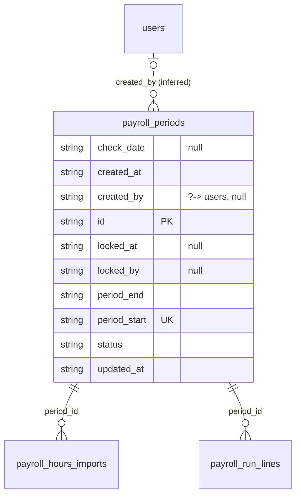

# Table: payroll_periods

_Generated 2026-09-07 by `scripts/schema-map`. Do not edit by hand; run `npm run schema:map`._

[Back to overview](../README.md) · Domain: [payroll_employee_lines](../clusters/payroll_employee_lines.md)

- Primary key: `id`
- Unique: `period_start`
- RLS: enabled
- Defined in: `types.ts`, `20260901005118_4edf45d4-24b6-4f0b-8030-9002673617da.sql`

## Columns

| Column | Type | Null | Keys | References |
| --- | --- | --- | --- | --- |
| `check_date` | string | yes |  |  |
| `created_at` | string |  |  |  |
| `created_by` | string | yes |  | [users](../tables/users.md).id (inferred) |
| `id` | string |  | PK |  |
| `locked_at` | string | yes |  |  |
| `locked_by` | string | yes |  |  |
| `period_end` | string |  |  |  |
| `period_start` | string |  | UK |  |
| `status` | string |  |  |  |
| `updated_at` | string |  |  |  |

## Relationships

**References**

- [users](../tables/users.md) via `created_by` (many-to-one, optional, **inferred**)

**Referenced by**

- [payroll_hours_imports](../tables/payroll_hours_imports.md) via `payroll_hours_imports.period_id` (one-to-many)
- [payroll_run_lines](../tables/payroll_run_lines.md) via `payroll_run_lines.period_id` (one-to-many)

## Neighbourhood

## RLS policies

| Policy | Command | Roles | Using | With check | Calls | Source |
| --- | --- | --- | --- | --- | --- | --- |
| Finance+ manage pay periods | ALL | authenticated | `public.has_role_or_higher(auth.uid(), 'finance'::app_role)` | `public.has_role_or_higher(auth.uid(), 'finance'::app_role)` | `has_role_or_higher` | `20260901005118_4edf45d4-24b6-4f0b-8030-9002673617da.sql` |

## Triggers

| Trigger | When | Function | Function touches |
| --- | --- | --- | --- |
| `trg_payroll_periods_updated` | BEFORE UPDATE FOR EACH ROW | `set_updated_at()` |  |

## Review notes

- **low** `connectedness/loose-links`: 1 link exist only by column name; the database does not enforce them, so deleting the target leaves dangling references. `created_by → users`

## Used by code

**Frontend**

- `src/pages/payroll/PayrollDashboard.tsx`
