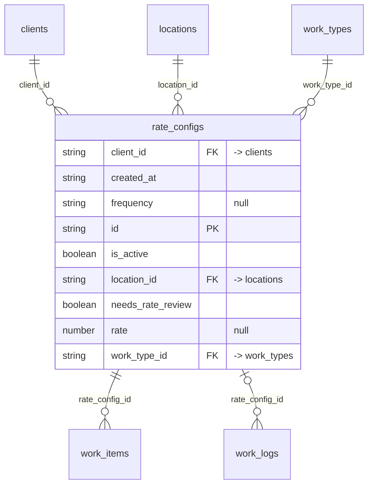

# Table: rate_configs

_Generated 2026-09-07 by `scripts/schema-map`. Do not edit by hand; run `npm run schema:map`._

[Back to overview](../README.md) · Domain: [client_portal_users](../clusters/client_portal_users.md)

- Primary key: `id`
- RLS: enabled
- Defined in: `types.ts`, `20251228061250_a4720166-45c5-4a95-b201-66363456cf66.sql`

## Columns

| Column | Type | Null | Keys | References |
| --- | --- | --- | --- | --- |
| `client_id` | string |  | FK | [clients](../tables/clients.md).id |
| `created_at` | string |  |  |  |
| `frequency` | string | yes |  |  |
| `id` | string |  | PK |  |
| `is_active` | boolean |  |  |  |
| `location_id` | string |  | FK | [locations](../tables/locations.md).id |
| `needs_rate_review` | boolean |  |  |  |
| `rate` | number | yes |  |  |
| `work_type_id` | string |  | FK | [work_types](../tables/work_types.md).id |

## Relationships

**References**

- [clients](../tables/clients.md) via `client_id` (many-to-one)
- [locations](../tables/locations.md) via `location_id` (many-to-one)
- [work_types](../tables/work_types.md) via `work_type_id` (many-to-one)

**Referenced by**

- [work_items](../tables/work_items.md) via `work_items.rate_config_id` (one-to-many)
- [work_logs](../tables/work_logs.md) via `work_logs.rate_config_id` (one-to-many, optional)

## Neighbourhood

## RLS policies

| Policy | Command | Roles | Using | With check | Calls | Source |
| --- | --- | --- | --- | --- | --- | --- |
| Employees can view assigned rate_configs | SELECT | public | `EXISTS ( SELECT 1 FROM user_locations ul WHERE ul.location_id = rate_configs.location_id AND ul.user_id = auth.uid() )` |  |  | `20251228061250_a4720166-45c5-4a95-b201-66363456cf66.sql` |
| Finance and admins can manage rate_configs | ALL | public | `has_role_or_higher(auth.uid(), 'finance'::app_role)` | `has_role_or_higher(auth.uid(), 'finance'::app_role)` | `has_role_or_higher` | `20260108203209_c88d0e0a-5752-4578-8d40-2a7eb45622e2.sql` |
| Finance can update rate_configs | UPDATE | public | `has_role_or_higher(auth.uid(), 'finance'::app_role)` |  | `has_role_or_higher` | `20251228061250_a4720166-45c5-4a95-b201-66363456cf66.sql` |
| Finance can view rate_configs | SELECT | public | `has_role_or_higher(auth.uid(), 'finance'::app_role)` |  | `has_role_or_higher` | `20251228061250_a4720166-45c5-4a95-b201-66363456cf66.sql` |

## Used by SQL

- function `get_portal_location_work_items()` (security definer)
- function `get_portal_work_history()` (security definer)
- function `get_report_data()` (security definer)
- policy "Employees can insert work_items" on [work_items](../tables/work_items.md)
- policy "Employees can view assigned work_items" on [work_items](../tables/work_items.md)
- policy "Employees can insert work_logs" on [work_logs](../tables/work_logs.md)
- policy "Employees can view work_logs at assigned locations" on [work_logs](../tables/work_logs.md)

## Used by code

**Frontend**

- `src/components/AddVehicleModal.tsx`
- `src/components/CSVImportModal.tsx`
- `src/components/EditServiceModal.tsx`
- `src/pages/EmployeeDashboard.tsx`
- `src/pages/FinanceThisWeek.tsx`
- `src/pages/RateCard.tsx`
- `src/pages/WorkItems.tsx`
