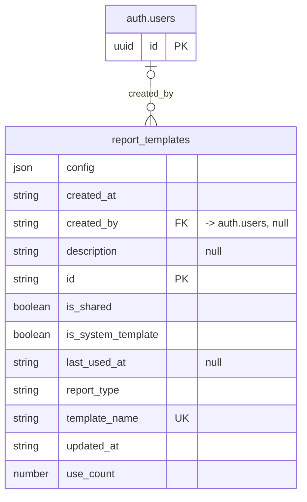

# Table: report_templates

_Generated 2026-09-05 by `scripts/schema-map`. Do not edit by hand; run `npm run schema:map`._

[Back to overview](../README.md) · Domain: [auth.users](../clusters/auth_users.md)

- Primary key: `id`
- Unique: `template_name`
- RLS: enabled
- Defined in: `types.ts`, `20251106072318_f52b608e-d650-4fb0-829a-ebc8971a41da.sql`, `20260812223435_0d13f6cf-ca2f-4bfa-9df6-2cb3efeac7e8.sql`

## Columns

| Column | Type | Null | Keys | References |
| --- | --- | --- | --- | --- |
| `config` | json |  |  |  |
| `created_at` | string |  |  |  |
| `created_by` | string | yes | FK | auth.users.id |
| `description` | string | yes |  |  |
| `id` | string |  | PK |  |
| `is_shared` | boolean |  |  |  |
| `is_system_template` | boolean |  |  |  |
| `last_used_at` | string | yes |  |  |
| `report_type` | string |  |  |  |
| `template_name` | string |  | UK |  |
| `updated_at` | string |  |  |  |
| `use_count` | number |  |  |  |

## Relationships

**References**

- `auth.users` via `created_by` (many-to-one, optional, other schema)

## Neighbourhood

## RLS policies

| Policy | Command | Roles | Using | With check | Calls | Source |
| --- | --- | --- | --- | --- | --- | --- |
| Creators can update their templates | UPDATE | public | `created_by = auth.uid() OR has_role(auth.uid(), 'admin'::app_role)` |  | `has_role` | `20251106072318_f52b608e-d650-4fb0-829a-ebc8971a41da.sql` |
| Finance users can create templates | INSERT | public | `` | `has_role_or_higher(auth.uid(), 'finance'::app_role) AND created_by = auth.uid()` | `has_role_or_higher` | `20251106072318_f52b608e-d650-4fb0-829a-ebc8971a41da.sql` |
| Finance users can view shared templates | SELECT | public | `has_role_or_higher(auth.uid(), 'finance'::app_role)` |  | `has_role_or_higher` | `20251106072318_f52b608e-d650-4fb0-829a-ebc8971a41da.sql` |
| Template deletion by owner or higher role | DELETE | authenticated | `is_system_template = false AND public.can_delete_report_template(created_by)` |  | `can_delete_report_template` | `20260812224139_2a25cb70-c1e7-4404-b28e-b242b9208e35.sql` |

## Used by code

**Frontend**

- `src/components/reports/TemplateManager.tsx`
