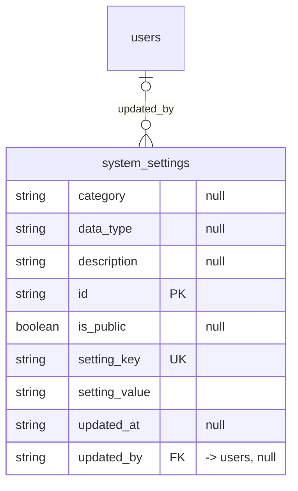

# Table: system_settings

_Generated 2026-09-07 by `scripts/schema-map`. Do not edit by hand; run `npm run schema:map`._

[Back to overview](../README.md) · Domain: [users](../clusters/users.md)

- Primary key: `id`
- Unique: `setting_key`
- RLS: enabled
- Defined in: `types.ts`, `20251011054150_29aaf8ff-e3c9-445f-8d01-bdf978d62c52.sql`, `20251012193712_3f6539b2-be8a-49dc-b7d7-832b78b2ac84.sql`

## Columns

| Column | Type | Null | Keys | References |
| --- | --- | --- | --- | --- |
| `category` | string | yes |  |  |
| `data_type` | string | yes |  |  |
| `description` | string | yes |  |  |
| `id` | string |  | PK |  |
| `is_public` | boolean | yes |  |  |
| `setting_key` | string |  | UK |  |
| `setting_value` | string |  |  |  |
| `updated_at` | string | yes |  |  |
| `updated_by` | string | yes | FK | [users](../tables/users.md).id |

## Relationships

**References**

- [users](../tables/users.md) via `updated_by` (many-to-one, optional)

## Neighbourhood

## RLS policies

| Policy | Command | Roles | Using | With check | Calls | Source |
| --- | --- | --- | --- | --- | --- | --- |
| Admin can insert system settings | INSERT | public |  | `has_role(auth.uid(), 'admin')` | `has_role` | `20251011054150_29aaf8ff-e3c9-445f-8d01-bdf978d62c52.sql` |
| Admin can update system settings | UPDATE | public | `has_role(auth.uid(), 'admin')` |  | `has_role` | `20251011054150_29aaf8ff-e3c9-445f-8d01-bdf978d62c52.sql` |
| All authenticated users can read system settings | SELECT | public | `true` |  |  | `20251011054150_29aaf8ff-e3c9-445f-8d01-bdf978d62c52.sql` |

## Triggers

| Trigger | When | Function | Function touches |
| --- | --- | --- | --- |
| `system_settings_audit_trigger` | AFTER UPDATE FOR EACH ROW | `log_system_setting_change()` | [system_settings_audit](../tables/system_settings_audit.md) |

## Used by SQL

- function `auto_update_cutoff_date()` (security definer)

## Used by code

**Edge functions**

- `update-cutoff-date`

**Frontend**

- `src/lib/cutoff.ts`
- `src/lib/dealershipRates.ts`
- `src/pages/dealership/DealershipRates.tsx`
- `src/pages/portal/PortalAuthCallback.tsx`
- `src/pages/portal/PortalLogin.tsx`
