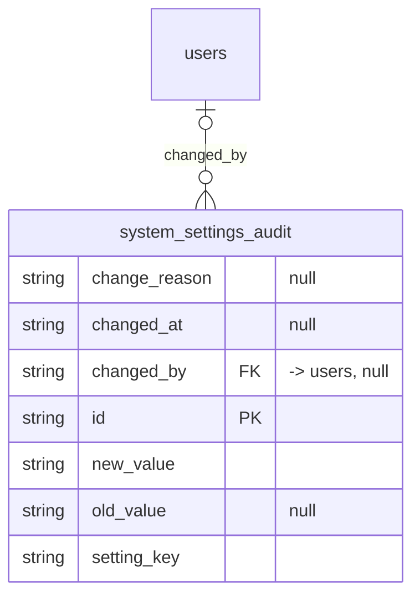

# Table: system_settings_audit

_Generated 2026-09-05 by `scripts/schema-map`. Do not edit by hand; run `npm run schema:map`._

[Back to overview](../README.md) · Domain: [users](../clusters/users.md)

- Primary key: `id`
- RLS: enabled
- Defined in: `types.ts`, `20251011054150_29aaf8ff-e3c9-445f-8d01-bdf978d62c52.sql`

## Columns

| Column | Type | Null | Keys | References |
| --- | --- | --- | --- | --- |
| `change_reason` | string | yes |  |  |
| `changed_at` | string | yes |  |  |
| `changed_by` | string | yes | FK | [users](../tables/users.md).id |
| `id` | string |  | PK |  |
| `new_value` | string |  |  |  |
| `old_value` | string | yes |  |  |
| `setting_key` | string |  |  |  |

## Relationships

**References**

- [users](../tables/users.md) via `changed_by` (many-to-one, optional)

## Neighbourhood

## RLS policies

| Policy | Command | Roles | Using | With check | Calls | Source |
| --- | --- | --- | --- | --- | --- | --- |
| All authenticated users can read audit trail | SELECT | public | `true` |  |  | `20251011054150_29aaf8ff-e3c9-445f-8d01-bdf978d62c52.sql` |
| System can insert audit records | INSERT | public |  | `true` |  | `20251011054150_29aaf8ff-e3c9-445f-8d01-bdf978d62c52.sql` |

## Used by SQL

- function `auto_update_cutoff_date()` (security definer)
- function `log_system_setting_change()` (security definer)

## Used by code

**Frontend**

- `src/lib/cutoff.ts`
- `src/pages/AdminSettings.tsx`
