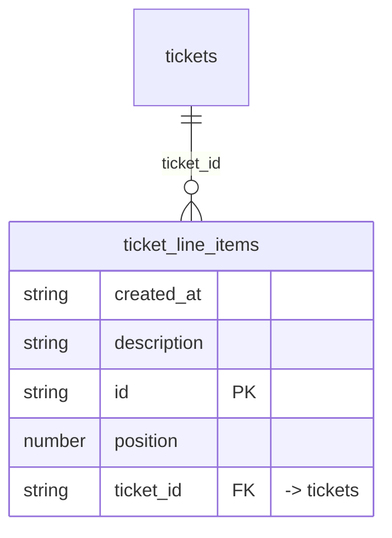

# Table: ticket_line_items

_Generated 2026-09-05 by `scripts/schema-map`. Do not edit by hand; run `npm run schema:map`._

[Back to overview](../README.md) · Domain: [tickets](../clusters/tickets.md)

- Primary key: `id`
- Unique: `ticket_id`, `position`
- RLS: enabled
- Defined in: `types.ts`, `20260831234441_48116fbc-7407-44a6-b254-8ab925dbec00.sql`

## Columns

| Column | Type | Null | Keys | References |
| --- | --- | --- | --- | --- |
| `created_at` | string |  |  |  |
| `description` | string |  |  |  |
| `id` | string |  | PK |  |
| `position` | number |  |  |  |
| `ticket_id` | string |  | FK | [tickets](../tables/tickets.md).id |

## Relationships

**References**

- [tickets](../tables/tickets.md) via `ticket_id` (many-to-one)

## Neighbourhood

## RLS policies

| Policy | Command | Roles | Using | With check | Calls | Source |
| --- | --- | --- | --- | --- | --- | --- |
| Line items follow ticket visibility | SELECT | authenticated | `EXISTS ( SELECT 1 FROM public.tickets t WHERE t.id = ticket_id AND (t.submitted_by = auth.uid() OR public.has_role_or_h…` |  | `has_role_or_higher` | `20260831234441_48116fbc-7407-44a6-b254-8ab925dbec00.sql` |
| Ticket owner can add line items | INSERT | authenticated |  | `EXISTS ( SELECT 1 FROM public.tickets t WHERE t.id = ticket_id AND t.submitted_by = auth.uid() )` |  | `20260831234441_48116fbc-7407-44a6-b254-8ab925dbec00.sql` |

## Used by code

**Frontend**

- `src/components/tickets/SubmitTicketModal.tsx`
- `src/components/tickets/TicketList.tsx`
