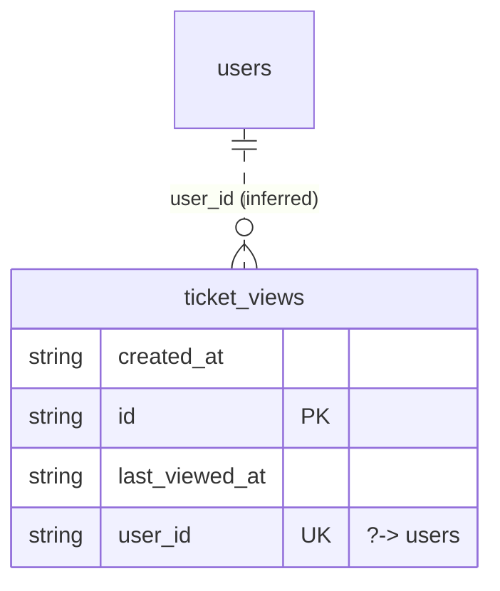

# Table: ticket_views

_Generated 2026-09-05 by `scripts/schema-map`. Do not edit by hand; run `npm run schema:map`._

[Back to overview](../README.md) · Domain: [users](../clusters/users.md)

- Primary key: `id`
- Unique: `user_id`
- RLS: enabled
- Defined in: `types.ts`, `20260831234441_48116fbc-7407-44a6-b254-8ab925dbec00.sql`

## Columns

| Column | Type | Null | Keys | References |
| --- | --- | --- | --- | --- |
| `created_at` | string |  |  |  |
| `id` | string |  | PK |  |
| `last_viewed_at` | string |  |  |  |
| `user_id` | string |  | UK | [users](../tables/users.md).id (inferred) |

## Relationships

**References**

- [users](../tables/users.md) via `user_id` (many-to-one, **inferred**)

## Neighbourhood

## RLS policies

| Policy | Command | Roles | Using | With check | Calls | Source |
| --- | --- | --- | --- | --- | --- | --- |
| Users insert their own ticket view marker | INSERT | authenticated | `` | `user_id = auth.uid()` |  | `20260831234441_48116fbc-7407-44a6-b254-8ab925dbec00.sql` |
| Users manage their own ticket view marker | SELECT | authenticated | `user_id = auth.uid()` |  |  | `20260831234441_48116fbc-7407-44a6-b254-8ab925dbec00.sql` |
| Users update their own ticket view marker | UPDATE | authenticated | `user_id = auth.uid()` | `user_id = auth.uid()` |  | `20260831234441_48116fbc-7407-44a6-b254-8ab925dbec00.sql` |

## Used by code

**Frontend**

- `src/hooks/useUnreadTicketCount.ts`
