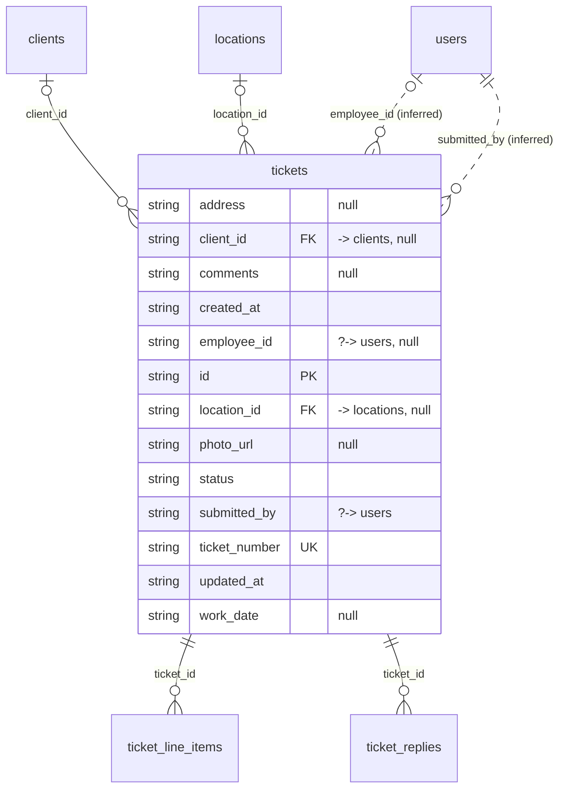

# Table: tickets

_Generated 2026-09-05 by `scripts/schema-map`. Do not edit by hand; run `npm run schema:map`._

[Back to overview](../README.md) · Domain: [tickets](../clusters/tickets.md)

- Primary key: `id`
- Unique: `ticket_number`
- RLS: enabled
- Defined in: `types.ts`, `20260831234441_48116fbc-7407-44a6-b254-8ab925dbec00.sql`

## Columns

| Column | Type | Null | Keys | References |
| --- | --- | --- | --- | --- |
| `address` | string | yes |  |  |
| `client_id` | string | yes | FK | [clients](../tables/clients.md).id |
| `comments` | string | yes |  |  |
| `created_at` | string |  |  |  |
| `employee_id` | string | yes |  | [users](../tables/users.md).id (inferred) |
| `id` | string |  | PK |  |
| `location_id` | string | yes | FK | [locations](../tables/locations.md).id |
| `photo_url` | string | yes |  |  |
| `status` | string |  |  |  |
| `submitted_by` | string |  |  | [users](../tables/users.md).id (inferred) |
| `ticket_number` | string |  | UK |  |
| `updated_at` | string |  |  |  |
| `work_date` | string | yes |  |  |

## Relationships

**References**

- [clients](../tables/clients.md) via `client_id` (many-to-one, optional)
- [locations](../tables/locations.md) via `location_id` (many-to-one, optional)
- [users](../tables/users.md) via `employee_id` (many-to-one, optional, **inferred**)
- [users](../tables/users.md) via `submitted_by` (many-to-one, **inferred**)

**Referenced by**

- [ticket_line_items](../tables/ticket_line_items.md) via `ticket_line_items.ticket_id` (one-to-many)
- [ticket_replies](../tables/ticket_replies.md) via `ticket_replies.ticket_id` (one-to-many)

## Neighbourhood

## RLS policies

| Policy | Command | Roles | Using | With check | Calls | Source |
| --- | --- | --- | --- | --- | --- | --- |
| Admins can delete tickets | DELETE | authenticated | `public.has_role_or_higher(auth.uid(), 'admin'::app_role)` |  | `has_role_or_higher` | `20260831234441_48116fbc-7407-44a6-b254-8ab925dbec00.sql` |
| Finance and above can update tickets | UPDATE | authenticated | `public.has_role_or_higher(auth.uid(), 'finance'::app_role)` | `public.has_role_or_higher(auth.uid(), 'finance'::app_role)` | `has_role_or_higher` | `20260831234441_48116fbc-7407-44a6-b254-8ab925dbec00.sql` |
| Managers and above can create tickets | INSERT | authenticated | `` | `submitted_by = auth.uid() AND public.has_role_or_higher(auth.uid(), 'manager'::app_role)` | `has_role_or_higher` | `20260831234441_48116fbc-7407-44a6-b254-8ab925dbec00.sql` |
| View own tickets or all for finance and above | SELECT | authenticated | `submitted_by = auth.uid() OR public.has_role_or_higher(auth.uid(), 'finance'::app_role)` |  | `has_role_or_higher` | `20260831234441_48116fbc-7407-44a6-b254-8ab925dbec00.sql` |

## Triggers

| Trigger | When | Function | Function touches |
| --- | --- | --- | --- |
| `trg_tickets_updated` | BEFORE UPDATE FOR EACH ROW | `set_updated_at()` |  |

## Used by SQL

- policy "Line items follow ticket visibility" on [ticket_line_items](../tables/ticket_line_items.md)
- policy "Ticket owner can add line items" on [ticket_line_items](../tables/ticket_line_items.md)
- policy "Participants can reply to tickets" on [ticket_replies](../tables/ticket_replies.md)
- policy "Replies follow ticket visibility" on [ticket_replies](../tables/ticket_replies.md)

## Used by code

**Frontend**

- `src/components/tickets/SubmitTicketModal.tsx`
- `src/components/tickets/TicketList.tsx`
- `src/hooks/useUnreadTicketCount.ts`
