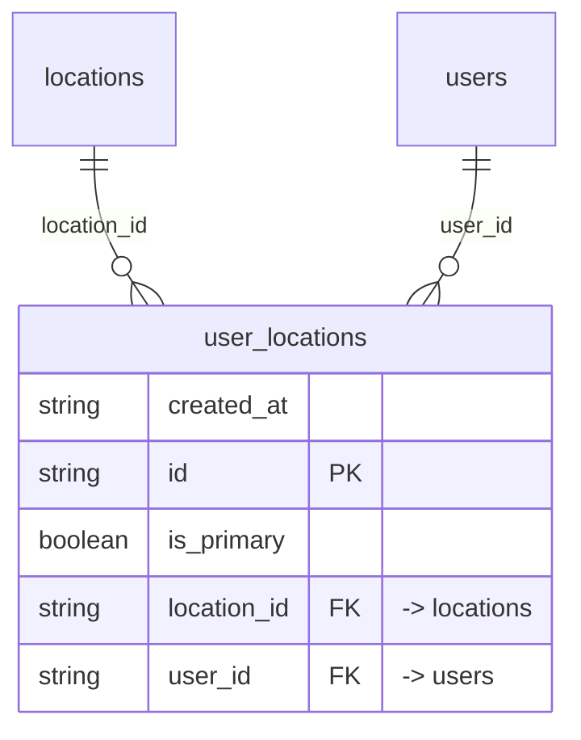

# Table: user_locations

_Generated 2026-09-07 by `scripts/schema-map`. Do not edit by hand; run `npm run schema:map`._

[Back to overview](../README.md) · Domain: [locations](../clusters/locations.md)

- Primary key: `id`
- Unique: `user_id`, `location_id`
- RLS: enabled
- Junction table (many-to-many link)
- Defined in: `types.ts`, `20251030030405_c0f5c1e3-a503-45bb-be01-37eb0ec2a514.sql`, `20251228042616_f79cb89f-5d54-49ad-b578-1998519041dd.sql`

## Columns

| Column | Type | Null | Keys | References |
| --- | --- | --- | --- | --- |
| `created_at` | string |  |  |  |
| `id` | string |  | PK |  |
| `is_primary` | boolean |  |  |  |
| `location_id` | string |  | FK | [locations](../tables/locations.md).id |
| `user_id` | string |  | FK | [users](../tables/users.md).id |

## Relationships

**References**

- [locations](../tables/locations.md) via `location_id` (many-to-one)
- [users](../tables/users.md) via `user_id` (many-to-one)

## Neighbourhood

## RLS policies

| Policy | Command | Roles | Using | With check | Calls | Source |
| --- | --- | --- | --- | --- | --- | --- |
| Finance and admins can manage location assignments | ALL | public | `has_role_or_higher(auth.uid(), 'finance'::app_role)` | `has_role_or_higher(auth.uid(), 'finance'::app_role)` | `has_role_or_higher` | `20260108203209_c88d0e0a-5752-4578-8d40-2a7eb45622e2.sql` |
| Users can view their own location assignments | SELECT | public | `auth.uid() = user_id` |  |  | `20251030030405_c0f5c1e3-a503-45bb-be01-37eb0ec2a514.sql` |
| Users with manager role or higher can view all location ass… | SELECT | public | `has_role_or_higher(auth.uid(), 'manager'::app_role)` |  | `has_role_or_higher` | `20251030030405_c0f5c1e3-a503-45bb-be01-37eb0ec2a514.sql` |

## Used by SQL

- function `assign_admins_to_new_location()` (security definer)
- function `assign_all_locations_to_new_admin()` (security definer)
- policy "Employees can view assigned clients" on [clients](../tables/clients.md)
- policy "Employees insert their own batches" on [dealership_wash_batches](../tables/dealership_wash_batches.md)
- policy "Employees view batches at assigned locations" on [dealership_wash_batches](../tables/dealership_wash_batches.md)
- policy "Employees can view assigned locations" on [locations](../tables/locations.md)
- policy "Employees can view assigned rate_configs" on [rate_configs](../tables/rate_configs.md)
- policy "Employees can view requests for assigned locations" on [wash_requests](../tables/wash_requests.md)
- policy "Employees can insert work_items" on [work_items](../tables/work_items.md)
- policy "Employees can view assigned work_items" on [work_items](../tables/work_items.md)
- policy "Employees can insert work_logs" on [work_logs](../tables/work_logs.md)
- policy "Employees can view work_logs at assigned locations" on [work_logs](../tables/work_logs.md)

## Used by code

**Frontend**

- `src/components/CreateUserModal.tsx`
- `src/components/EditUserModal.tsx`
- `src/contexts/AuthContext.tsx`
- `src/pages/Users.tsx`
- `src/pages/dealership/DealershipRequests.tsx`
