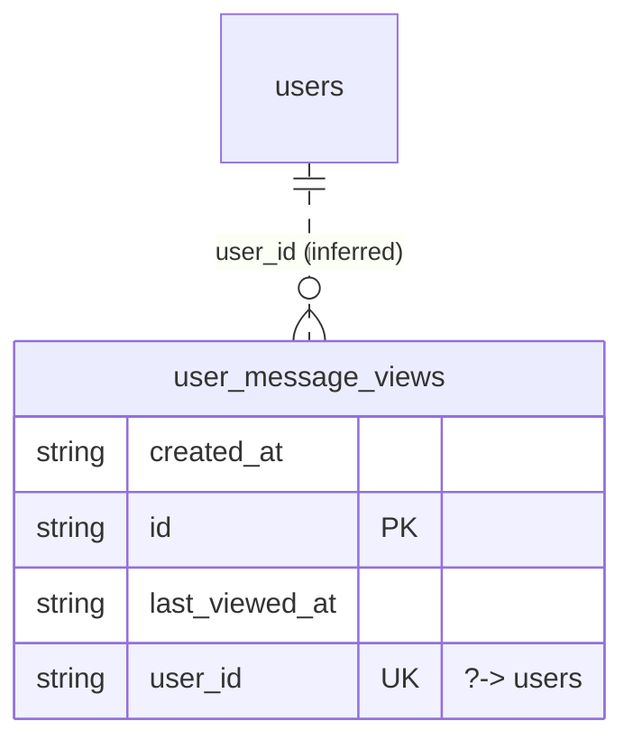

# Table: user_message_views

_Generated 2026-09-07 by `scripts/schema-map`. Do not edit by hand; run `npm run schema:map`._

[Back to overview](../README.md) · Domain: [users](../clusters/users.md)

- Primary key: `id`
- Unique: `user_id`
- RLS: enabled
- Defined in: `types.ts`, `20251217031905_b679954c-c7dc-4029-9389-fe9ee76d9540.sql`, `20260721044724_11b216aa-73c9-4d96-aa1b-78f26aeaf059.sql`, `20260721044736_3ed8489b-5b9e-4434-9b74-350410ea2ec1.sql`

## Columns

| Column | Type | Null | Keys | References |
| --- | --- | --- | --- | --- |
| `created_at` | string |  |  |  |
| `id` | string |  | PK |  |
| `last_viewed_at` | string |  |  |  |
| `user_id` | string |  | UK | [users](../tables/users.md).id (inferred) |

## Relationships

**References**

- [users](../tables/users.md) via `user_id` (many-to-one, **inferred**)

## Neighbourhood

## RLS policies

| Policy | Command | Roles | Using | With check | Calls | Source |
| --- | --- | --- | --- | --- | --- | --- |
| Users can insert their own message view record | INSERT | authenticated |  | `auth.uid() = user_id` |  | `20260721044724_11b216aa-73c9-4d96-aa1b-78f26aeaf059.sql` |
| Users can update their own message view record | UPDATE | authenticated | `auth.uid() = user_id` | `auth.uid() = user_id` |  | `20260721044724_11b216aa-73c9-4d96-aa1b-78f26aeaf059.sql` |
| Users can view their own message view record | SELECT | authenticated | `auth.uid() = user_id` |  |  | `20260721044724_11b216aa-73c9-4d96-aa1b-78f26aeaf059.sql` |

## Review notes

- **low** `connectedness/loose-links`: 1 link exist only by column name; the database does not enforce them, so deleting the target leaves dangling references. `user_id → users`

## Used by code

**Frontend**

- `src/hooks/usePortalUnreadCount.ts`
- `src/hooks/useUnreadMessageCount.ts`
