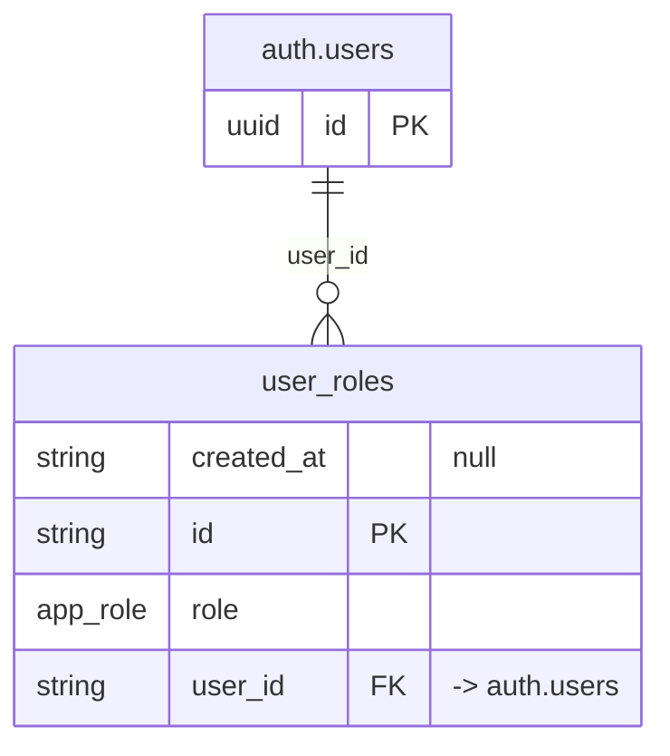

# Table: user_roles

_Generated 2026-09-07 by `scripts/schema-map`. Do not edit by hand; run `npm run schema:map`._

[Back to overview](../README.md) · Domain: [auth.users](../clusters/auth_users.md)

- Primary key: `id`
- Unique: `user_id`, `role`
- RLS: enabled
- Defined in: `types.ts`, `20251011024227_7ba1ded1-8026-4ee1-b030-b62afb75d707.sql`

## Columns

| Column | Type | Null | Keys | References |
| --- | --- | --- | --- | --- |
| `created_at` | string | yes |  |  |
| `id` | string |  | PK |  |
| `role` | enum `app_role` |  |  |  |
| `user_id` | string |  | FK | auth.users.id |

## Relationships

**References**

- `auth.users` via `user_id` (many-to-one, other schema)

## Neighbourhood

## RLS policies

| Policy | Command | Roles | Using | With check | Calls | Source |
| --- | --- | --- | --- | --- | --- | --- |
| Admins can delete roles | DELETE | public | `public.has_role(auth.uid(), 'admin'::app_role)` |  | `has_role` | `20251011024241_c9f67c09-df20-4269-ab5d-d90b22a70c96.sql` |
| Admins can insert roles | INSERT | public |  | `public.has_role(auth.uid(), 'admin'::app_role)` | `has_role` | `20251011024241_c9f67c09-df20-4269-ab5d-d90b22a70c96.sql` |
| Admins can update roles | UPDATE | public | `public.has_role(auth.uid(), 'admin'::app_role)` |  | `has_role` | `20251011024241_c9f67c09-df20-4269-ab5d-d90b22a70c96.sql` |
| Employees can view their own roles | SELECT | public | `auth.uid() = user_id AND public.has_role(auth.uid(), 'employee'::app_role)` |  | `has_role` | `20251011030116_d0a26d5e-5ff4-4bd6-bb5b-dbf50e5222c4.sql` |
| Finance can delete lower roles | DELETE | public | `has_role_or_higher(auth.uid(), 'finance'::app_role) AND role NOT IN ('admin'::app_role, 'super_admin'::app_role)` |  | `has_role_or_higher` | `20260108203209_c88d0e0a-5752-4578-8d40-2a7eb45622e2.sql` |
| Finance can insert roles up to finance | INSERT | public |  | `has_role_or_higher(auth.uid(), 'finance'::app_role) AND role NOT IN ('admin'::app_role, 'super_admin'::app_role)` | `has_role_or_higher` | `20260108203209_c88d0e0a-5752-4578-8d40-2a7eb45622e2.sql` |
| Finance can update lower roles | UPDATE | public | `has_role_or_higher(auth.uid(), 'finance'::app_role) AND role NOT IN ('admin'::app_role, 'super_admin'::app_role)` |  | `has_role_or_higher` | `20260108203209_c88d0e0a-5752-4578-8d40-2a7eb45622e2.sql` |
| Prevent deleting super admin roles by non-super-admins | DELETE | public | `role != 'super_admin' OR has_role(auth.uid(), 'super_admin')` |  | `has_role` | `20251012034943_f78bd2c2-5033-42a7-b3ed-eac03613c494.sql` |
| Prevent editing super admin users by non-super-admins | UPDATE | public | `role != 'super_admin' OR has_role(auth.uid(), 'super_admin')` |  | `has_role` | `20251012034943_f78bd2c2-5033-42a7-b3ed-eac03613c494.sql` |
| Users with manager role or higher can view all roles | SELECT | public | `has_role_or_higher(auth.uid(), 'manager'::app_role) AND ( has_role(auth.uid(), 'super_admin'::app_role) OR role <> 'sup…` |  | `has_role_or_higher`, `has_role` | `20251012042751_d48eea6e-c18e-4df1-848c-be5b5a180b42.sql` |

## Triggers

| Trigger | When | Function | Function touches |
| --- | --- | --- | --- |
| `trg_assign_all_locations_to_new_admin` | AFTER INSERT FOR EACH ROW | `assign_all_locations_to_new_admin()` | [user_locations](../tables/user_locations.md), [locations](../tables/locations.md) |

## Used by SQL

- function `assign_admins_to_new_location()` (security definer)
- function `has_role()` (security definer)
- function `has_role_or_higher()` (security definer)
- function `is_super_admin()` (security definer)
- policy "Managers and admins can view audit logs" on [audit_log](../tables/audit_log.md)
- policy "Finance can read users" on [users](../tables/users.md)
- policy "Finance can update lower-role users" on [users](../tables/users.md)

## Used by code

**Edge functions**

- `approve-portal-request`
- `create-user`
- `reset-user-password`
- `send-error-report-email`
- `send-portal-password-reset`
- `send-welcome-email`

**Frontend**

- `src/components/EditUserModal.tsx`
- `src/lib/roleUtils.ts`
- `src/pages/Users.tsx`
