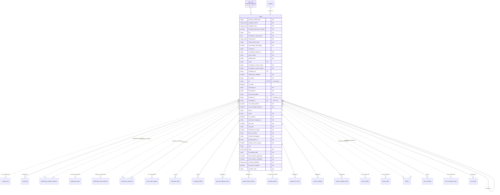

# Table: users

_Generated 2026-09-05 by `scripts/schema-map`. Do not edit by hand; run `npm run schema:map`._

[Back to overview](../README.md) · Domain: [users](../clusters/users.md)

- Primary key: `id`
- Unique: `email`
- Unique: `employee_id`
- RLS: enabled
- Hub table: referenced by 11 other tables
- Defined in: `types.ts`, `20251011023101_3f0c6246-8a43-49d4-9378-c0090113f7f1.sql`, `20251012190637_4d1fad8e-84b9-4664-aa7f-974d7633e0e3.sql`, `20251012193712_3f6539b2-be8a-49dc-b7d7-832b78b2ac84.sql`, `20251228042616_f79cb89f-5d54-49ad-b578-1998519041dd.sql`, `20260109194306_82e75ad6-0701-46f2-a6a6-a107a8642644.sql`

## Columns

| Column | Type | Null | Keys | References |
| --- | --- | --- | --- | --- |
| `account_locked_until` | string | yes |  |  |
| `assigned_clients` | string_array | yes |  |  |
| `available_days` | string_array | yes |  |  |
| `average_wash_time_minutes` | number | yes |  |  |
| `bio` | string | yes |  |  |
| `certification_expiry_dates` | json | yes |  |  |
| `certifications` | string_array | yes |  |  |
| `client_access_level` | string | yes |  |  |
| `commission_percentage` | number | yes |  |  |
| `created_at` | string |  |  |  |
| `credentials_shared_at` | string | yes |  |  |
| `date_of_birth` | string | yes |  |  |
| `default_shift` | string | yes |  |  |
| `email` | string |  | UK |  |
| `emergency_contact_name` | string | yes |  |  |
| `emergency_contact_phone` | string | yes |  |  |
| `employee_id` | string |  | UK |  |
| `failed_login_attempts` | number | yes |  |  |
| `hire_date` | string | yes |  |  |
| `id` | string |  | PK, FK | auth.users.id |
| `is_active` | boolean |  |  |  |
| `last_login_at` | string | yes |  |  |
| `last_login_ip` | string | yes |  |  |
| `last_training_date` | string | yes |  |  |
| `location_id` | string | yes | FK | [locations](../tables/locations.md).id |
| `manager_id` | string | yes | FK | [users](../tables/users.md).id |
| `max_daily_washes` | number | yes |  |  |
| `must_change_password` | boolean | yes |  |  |
| `name` | string |  |  |  |
| `notes` | string | yes |  |  |
| `on_vacation` | boolean | yes |  |  |
| `password_changed_at` | string | yes |  |  |
| `pay_rate` | number | yes |  |  |
| `pay_type` | string | yes |  |  |
| `performance_rating` | number | yes |  |  |
| `phone_number` | string | yes |  |  |
| `preferred_language` | string | yes |  |  |
| `profile_photo_url` | string | yes |  |  |
| `quality_score_average` | number | yes |  |  |
| `role` | string |  |  |  |
| `tags` | string_array | yes |  |  |
| `termination_date` | string | yes |  |  |
| `total_revenue_generated` | number | yes |  |  |
| `total_washes_completed` | number | yes |  |  |
| `training_completed` | string_array | yes |  |  |
| `two_factor_enabled` | boolean | yes |  |  |
| `vacation_until` | string | yes |  |  |

## Relationships

**References**

- `auth.users` via `id` (many-to-one, other schema)
- [locations](../tables/locations.md) via `location_id` (many-to-one, optional)
- [users](../tables/users.md) via `manager_id` (many-to-one, optional)

**Referenced by**

- [activity_logs](../tables/activity_logs.md) via `activity_logs.user_id` (one-to-many, **inferred**)
- [audit_log](../tables/audit_log.md) via `audit_log.changed_by` (one-to-many, optional)
- [dealership_location_requests](../tables/dealership_location_requests.md) via `dealership_location_requests.requested_by` (one-to-many, **inferred**)
- [dealership_location_requests](../tables/dealership_location_requests.md) via `dealership_location_requests.reviewed_by` (one-to-many, optional, **inferred**)
- [dealership_rates](../tables/dealership_rates.md) via `dealership_rates.created_by` (one-to-many, optional, **inferred**)
- [dealership_wash_batches](../tables/dealership_wash_batches.md) via `dealership_wash_batches.employee_id` (one-to-many, **inferred**)
- [employee_comments](../tables/employee_comments.md) via `employee_comments.employee_id` (one-to-many, **inferred**)
- [employee_comments](../tables/employee_comments.md) via `employee_comments.recipient_id` (one-to-many, optional)
- [error_report_replies](../tables/error_report_replies.md) via `error_report_replies.user_id` (one-to-many, **inferred**)
- [message_reads](../tables/message_reads.md) via `message_reads.user_id` (one-to-many)
- [message_replies](../tables/message_replies.md) via `message_replies.user_id` (one-to-many)
- [payroll_employee_lines](../tables/payroll_employee_lines.md) via `payroll_employee_lines.employee_id` (one-to-many, optional)
- [payroll_hours_imports](../tables/payroll_hours_imports.md) via `payroll_hours_imports.employee_id` (one-to-many, optional)
- [payroll_periods](../tables/payroll_periods.md) via `payroll_periods.created_by` (one-to-many, optional, **inferred**)
- [payroll_run_lines](../tables/payroll_run_lines.md) via `payroll_run_lines.employee_id` (one-to-many, optional)
- [system_settings](../tables/system_settings.md) via `system_settings.updated_by` (one-to-many, optional)
- [system_settings_audit](../tables/system_settings_audit.md) via `system_settings_audit.changed_by` (one-to-many, optional)
- [ticket_replies](../tables/ticket_replies.md) via `ticket_replies.user_id` (one-to-many, **inferred**)
- [ticket_views](../tables/ticket_views.md) via `ticket_views.user_id` (one-to-many, **inferred**)
- [tickets](../tables/tickets.md) via `tickets.employee_id` (one-to-many, optional, **inferred**)
- [tickets](../tables/tickets.md) via `tickets.submitted_by` (one-to-many, **inferred**)
- [user_locations](../tables/user_locations.md) via `user_locations.user_id` (one-to-many)
- [user_message_views](../tables/user_message_views.md) via `user_message_views.user_id` (one-to-many, **inferred**)
- [work_logs](../tables/work_logs.md) via `work_logs.employee_id` (one-to-many)

**Many-to-many**

- [employee_comments](../tables/employee_comments.md) via [message_reads](../tables/message_reads.md)
- [locations](../tables/locations.md) via [user_locations](../tables/user_locations.md)

## Neighbourhood

## RLS policies

| Policy | Command | Roles | Using | With check | Calls | Source |
| --- | --- | --- | --- | --- | --- | --- |
| Admin can insert users | INSERT | public | `` | `public.has_role(auth.uid(), 'admin'::app_role)` | `has_role` | `20251011030116_d0a26d5e-5ff4-4bd6-bb5b-dbf50e5222c4.sql` |
| Admin can update users | UPDATE | public | `public.has_role(auth.uid(), 'admin'::app_role)` |  | `has_role` | `20251011030116_d0a26d5e-5ff4-4bd6-bb5b-dbf50e5222c4.sql` |
| Finance can insert users | INSERT | public | `` | `has_role_or_higher(auth.uid(), 'finance'::app_role) AND role NOT IN ('admin', 'super_admin')` | `has_role_or_higher` | `20260108203623_134f6ee5-c617-44a6-82ad-e0269ebb7204.sql` |
| Finance can read users | SELECT | public | `has_role_or_higher(auth.uid(), 'finance'::app_role) AND ( has_role(auth.uid(), 'super_admin'::app_role) OR NOT EXISTS (…` |  | `has_role_or_higher`, `has_role` | `20260108203623_134f6ee5-c617-44a6-82ad-e0269ebb7204.sql` |
| Finance can update lower-role users | UPDATE | public | `has_role_or_higher(auth.uid(), 'finance'::app_role) AND NOT EXISTS ( SELECT 1 FROM user_roles ur WHERE ur.user_id = use…` |  | `has_role_or_higher` | `20260108203623_134f6ee5-c617-44a6-82ad-e0269ebb7204.sql` |
| Users can read their own record | SELECT | public | `auth.uid() = id` |  |  | `20251215185716_c092f9a9-4a97-436d-a57b-9796f3bd06a9.sql` |
| Users can update their own password reset flag | UPDATE | public | `auth.uid() = id` | `auth.uid() = id` |  | `20260116010220_b095b15e-4685-454e-8707-d6eb642b0f92.sql` |
| Users with manager role or higher can read all users | SELECT | public | `has_role_or_higher(auth.uid(), 'manager'::app_role) AND ( has_role(auth.uid(), 'super_admin'::app_role) OR NOT public.i…` |  | `has_role_or_higher`, `has_role`, `is_super_admin` | `20251012181403_43a772c9-78f6-483c-a40d-b8654e0d66c2.sql` |

## Used by SQL

- function `get_user_display_info()` (security definer)

## Used by code

**Edge functions**

- `create-portal-user`
- `create-user`
- `delete-user`
- `ensure-portal-user`
- `reset-user-password`
- `send-error-report-email`

**Frontend**

- `src/components/CreateUserModal.tsx`
- `src/components/EditUserModal.tsx`
- `src/components/LocationTable.tsx`
- `src/contexts/AuthContext.tsx`
- `src/pages/AdminDashboard.tsx`
- `src/pages/AdminSettings.tsx`
- `src/pages/ChangePassword.tsx`
- `src/pages/CreateUser.tsx`
- `src/pages/FinanceThisWeek.tsx`
- `src/pages/Users.tsx`
