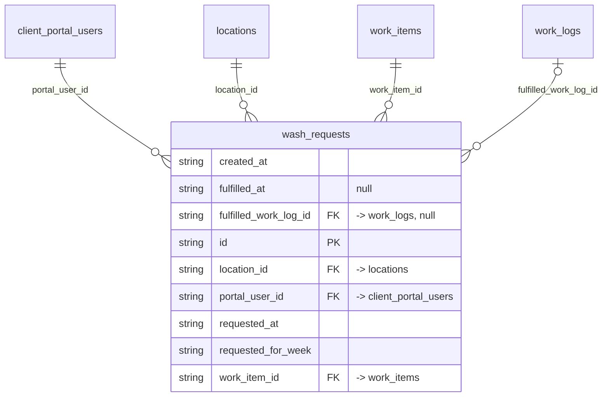

# Table: wash_requests

_Generated 2026-09-05 by `scripts/schema-map`. Do not edit by hand; run `npm run schema:map`._

[Back to overview](../README.md) · Domain: [client_portal_users](../clusters/client_portal_users.md)

- Primary key: `id`
- Unique: `work_item_id`, `requested_for_week`
- RLS: enabled
- Defined in: `types.ts`, `20260721041612_70660937-8491-4e5d-a0c4-f7d58e6330ac.sql`

## Columns

| Column | Type | Null | Keys | References |
| --- | --- | --- | --- | --- |
| `created_at` | string |  |  |  |
| `fulfilled_at` | string | yes |  |  |
| `fulfilled_work_log_id` | string | yes | FK | [work_logs](../tables/work_logs.md).id |
| `id` | string |  | PK |  |
| `location_id` | string |  | FK | [locations](../tables/locations.md).id |
| `portal_user_id` | string |  | FK | [client_portal_users](../tables/client_portal_users.md).id |
| `requested_at` | string |  |  |  |
| `requested_for_week` | string |  |  |  |
| `work_item_id` | string |  | FK | [work_items](../tables/work_items.md).id |

## Relationships

**References**

- [client_portal_users](../tables/client_portal_users.md) via `portal_user_id` (many-to-one)
- [locations](../tables/locations.md) via `location_id` (many-to-one)
- [work_items](../tables/work_items.md) via `work_item_id` (many-to-one)
- [work_logs](../tables/work_logs.md) via `fulfilled_work_log_id` (many-to-one, optional)

## Neighbourhood

## RLS policies

| Policy | Command | Roles | Using | With check | Calls | Source |
| --- | --- | --- | --- | --- | --- | --- |
| Employees can view requests for assigned locations | SELECT | authenticated | `EXISTS ( SELECT 1 FROM public.user_locations ul WHERE ul.user_id = auth.uid() AND ul.location_id = wash_requests.locati…` |  |  | `20260721041612_70660937-8491-4e5d-a0c4-f7d58e6330ac.sql` |
| Finance and admins can manage all requests | ALL | authenticated | `public.has_role_or_higher(auth.uid(), 'finance'::app_role)` | `public.has_role_or_higher(auth.uid(), 'finance'::app_role)` | `has_role_or_higher` | `20260721041612_70660937-8491-4e5d-a0c4-f7d58e6330ac.sql` |
| Finance and admins can view all requests | SELECT | authenticated | `public.has_role_or_higher(auth.uid(), 'finance'::app_role)` |  | `has_role_or_higher` | `20260721041612_70660937-8491-4e5d-a0c4-f7d58e6330ac.sql` |
| Portal users can cancel their own open requests | DELETE | authenticated | `portal_user_id = public.get_portal_user_id(auth.uid()) AND fulfilled_at IS NULL` |  | `get_portal_user_id` | `20260721041612_70660937-8491-4e5d-a0c4-f7d58e6330ac.sql` |
| Portal users can create requests for their locations | INSERT | authenticated |  | `public.portal_has_location(auth.uid(), location_id) AND portal_user_id = public.get_portal_user_id(auth.uid())` | `portal_has_location`, `get_portal_user_id` | `20260721041612_70660937-8491-4e5d-a0c4-f7d58e6330ac.sql` |
| Portal users can view their location requests | SELECT | authenticated | `public.portal_has_location(auth.uid(), location_id)` |  | `portal_has_location` | `20260721041612_70660937-8491-4e5d-a0c4-f7d58e6330ac.sql` |

## Used by SQL

- function `auto_fulfill_wash_requests()` (security definer)
- function `get_portal_location_work_items()` (security definer)

## Used by code

_No direct queries found in code._
