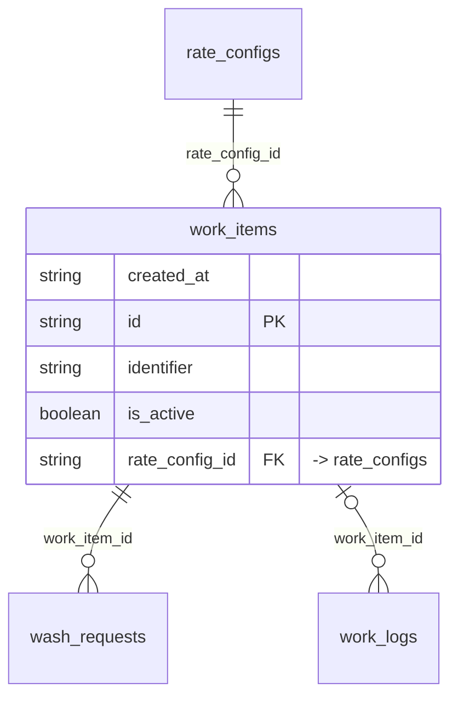

# Table: work_items

_Generated 2026-09-05 by `scripts/schema-map`. Do not edit by hand; run `npm run schema:map`._

[Back to overview](../README.md) · Domain: [client_portal_users](../clusters/client_portal_users.md)

- Primary key: `id`
- Unique: `rate_config_id`, `identifier`
- RLS: enabled
- Defined in: `types.ts`, `20251228061250_a4720166-45c5-4a95-b201-66363456cf66.sql`

## Columns

| Column | Type | Null | Keys | References |
| --- | --- | --- | --- | --- |
| `created_at` | string |  |  |  |
| `id` | string |  | PK |  |
| `identifier` | string |  |  |  |
| `is_active` | boolean |  |  |  |
| `rate_config_id` | string |  | FK | [rate_configs](../tables/rate_configs.md).id |

## Relationships

**References**

- [rate_configs](../tables/rate_configs.md) via `rate_config_id` (many-to-one)

**Referenced by**

- [wash_requests](../tables/wash_requests.md) via `wash_requests.work_item_id` (one-to-many)
- [work_logs](../tables/work_logs.md) via `work_logs.work_item_id` (one-to-many, optional)

## Neighbourhood

## RLS policies

| Policy | Command | Roles | Using | With check | Calls | Source |
| --- | --- | --- | --- | --- | --- | --- |
| Employees can insert work_items | INSERT | public |  | `EXISTS ( SELECT 1 FROM rate_configs rc JOIN user_locations ul ON ul.location_id = rc.location_id WHERE rc.id = work_ite…` |  | `20251228061250_a4720166-45c5-4a95-b201-66363456cf66.sql` |
| Employees can view assigned work_items | SELECT | public | `EXISTS ( SELECT 1 FROM rate_configs rc JOIN user_locations ul ON ul.location_id = rc.location_id WHERE rc.id = work_ite…` |  |  | `20251228061250_a4720166-45c5-4a95-b201-66363456cf66.sql` |
| Finance and admins can manage work_items | ALL | public | `has_role_or_higher(auth.uid(), 'finance'::app_role)` | `has_role_or_higher(auth.uid(), 'finance'::app_role)` | `has_role_or_higher` | `20260108203209_c88d0e0a-5752-4578-8d40-2a7eb45622e2.sql` |
| Finance can view work_items | SELECT | public | `has_role_or_higher(auth.uid(), 'finance'::app_role)` |  | `has_role_or_higher` | `20251228061250_a4720166-45c5-4a95-b201-66363456cf66.sql` |

## Used by SQL

- function `get_portal_location_work_items()` (security definer)
- function `get_portal_work_history()` (security definer)
- function `get_report_data()` (security definer)
- policy "Employees can insert work_logs" on [work_logs](../tables/work_logs.md)
- policy "Employees can view work_logs at assigned locations" on [work_logs](../tables/work_logs.md)

## Used by code

**Frontend**

- `src/components/AddVehicleModal.tsx`
- `src/components/CSVImportModal.tsx`
- `src/components/EditServiceModal.tsx`
- `src/components/WorkItemGrid.tsx`
- `src/pages/EmployeeDashboard.tsx`
- `src/pages/FinanceThisWeek.tsx`
- `src/pages/WorkItems.tsx`
