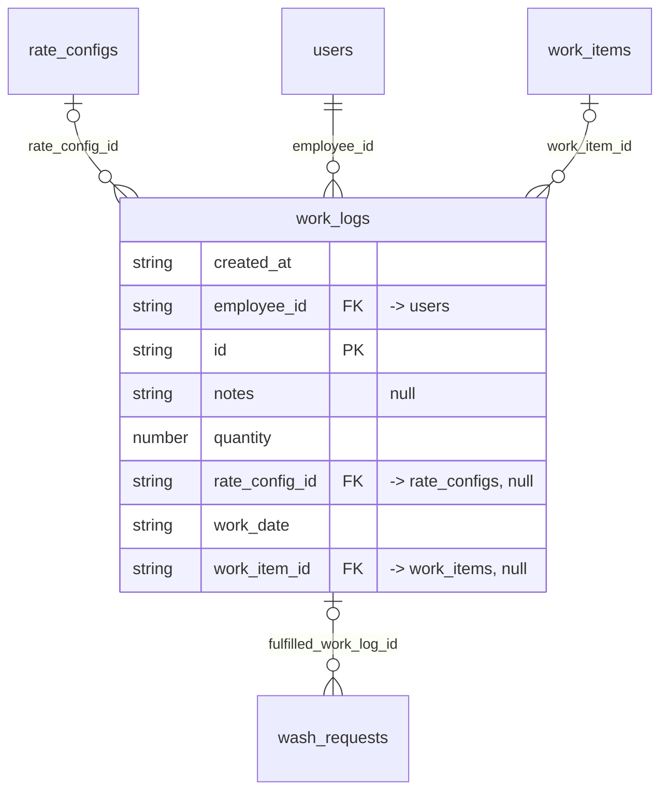

# Table: work_logs

_Generated 2026-09-05 by `scripts/schema-map`. Do not edit by hand; run `npm run schema:map`._

[Back to overview](../README.md) · Domain: [client_portal_users](../clusters/client_portal_users.md)

- Primary key: `id`
- RLS: enabled
- Defined in: `types.ts`, `20251228042616_f79cb89f-5d54-49ad-b578-1998519041dd.sql`, `20251228061250_a4720166-45c5-4a95-b201-66363456cf66.sql`

## Columns

| Column | Type | Null | Keys | References |
| --- | --- | --- | --- | --- |
| `created_at` | string |  |  |  |
| `employee_id` | string |  | FK | [users](../tables/users.md).id |
| `id` | string |  | PK |  |
| `notes` | string | yes |  |  |
| `quantity` | number |  |  |  |
| `rate_config_id` | string | yes | FK | [rate_configs](../tables/rate_configs.md).id |
| `work_date` | string |  |  |  |
| `work_item_id` | string | yes | FK | [work_items](../tables/work_items.md).id |

## Relationships

**References**

- [rate_configs](../tables/rate_configs.md) via `rate_config_id` (many-to-one, optional)
- [users](../tables/users.md) via `employee_id` (many-to-one)
- [work_items](../tables/work_items.md) via `work_item_id` (many-to-one, optional)

**Referenced by**

- [wash_requests](../tables/wash_requests.md) via `wash_requests.fulfilled_work_log_id` (one-to-many, optional)

## Neighbourhood

## RLS policies

| Policy | Command | Roles | Using | With check | Calls | Source |
| --- | --- | --- | --- | --- | --- | --- |
| Admins can manage work_logs | ALL | public | `has_role(auth.uid(), 'admin'::app_role)` | `has_role(auth.uid(), 'admin'::app_role)` | `has_role` | `20251228042616_f79cb89f-5d54-49ad-b578-1998519041dd.sql` |
| Employees can insert work_logs | INSERT | public | `` | `employee_id = auth.uid() AND ( (work_item_id IS NOT NULL AND EXISTS ( SELECT 1 FROM work_items wi JOIN rate_configs rc …` |  | `20251228061250_a4720166-45c5-4a95-b201-66363456cf66.sql` |
| Employees can view work_logs at assigned locations | SELECT | public | `employee_id = auth.uid() OR EXISTS ( SELECT 1 FROM work_items wi JOIN rate_configs rc ON rc.id = wi.rate_config_id JOIN…` |  |  | `20251229212813_9848c162-71d8-4948-b181-dfe7c391e6f5.sql` |
| Finance can view work_logs | SELECT | public | `has_role_or_higher(auth.uid(), 'finance'::app_role)` |  | `has_role_or_higher` | `20251228042616_f79cb89f-5d54-49ad-b578-1998519041dd.sql` |

## Triggers

| Trigger | When | Function | Function touches |
| --- | --- | --- | --- |
| `trg_auto_fulfill_wash_requests` | AFTER INSERT FOR EACH ROW | `auto_fulfill_wash_requests()` | [wash_requests](../tables/wash_requests.md) |

## Used by SQL

- function `get_portal_work_history()` (security definer)
- function `get_report_data()` (security definer)

## Used by code

**Frontend**

- `src/components/LogWorkModal.tsx`
- `src/pages/EmployeeDashboard.tsx`
- `src/pages/FinanceThisWeek.tsx`
- `src/pages/payroll/PayrollDashboard.tsx`
