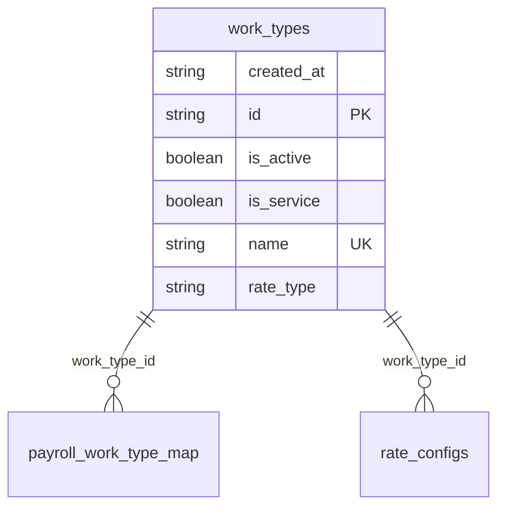

# Table: work_types

_Generated 2026-09-05 by `scripts/schema-map`. Do not edit by hand; run `npm run schema:map`._

[Back to overview](../README.md) · Domain: [client_portal_users](../clusters/client_portal_users.md)

- Primary key: `id`
- Unique: `name`
- RLS: enabled
- Defined in: `types.ts`, `20251228061250_a4720166-45c5-4a95-b201-66363456cf66.sql`, `20260315215659_fdee91c2-8810-4af3-88e3-9e60035401d5.sql`

## Columns

| Column | Type | Null | Keys | References |
| --- | --- | --- | --- | --- |
| `created_at` | string |  |  |  |
| `id` | string |  | PK |  |
| `is_active` | boolean |  |  |  |
| `is_service` | boolean |  |  |  |
| `name` | string |  | UK |  |
| `rate_type` | string |  |  |  |

## Relationships

**Referenced by**

- [payroll_work_type_map](../tables/payroll_work_type_map.md) via `payroll_work_type_map.work_type_id` (one-to-many)
- [rate_configs](../tables/rate_configs.md) via `rate_configs.work_type_id` (one-to-many)

## Neighbourhood

## RLS policies

| Policy | Command | Roles | Using | With check | Calls | Source |
| --- | --- | --- | --- | --- | --- | --- |
| Everyone can read work_types | SELECT | public | `true` |  |  | `20251228061250_a4720166-45c5-4a95-b201-66363456cf66.sql` |
| Finance and admins can manage work_types | ALL | public | `has_role_or_higher(auth.uid(), 'finance'::app_role)` | `has_role_or_higher(auth.uid(), 'finance'::app_role)` | `has_role_or_higher` | `20260108203209_c88d0e0a-5752-4578-8d40-2a7eb45622e2.sql` |

## Used by SQL

- function `get_portal_location_work_items()` (security definer)
- function `get_portal_work_history()` (security definer)
- function `get_report_data()` (security definer)

## Used by code

**Frontend**

- `src/components/CSVImportModal.tsx`
- `src/components/EditServiceModal.tsx`
- `src/components/reports/ReportFilters.tsx`
- `src/pages/FinanceThisWeek.tsx`
- `src/pages/RateCard.tsx`
- `src/pages/WorkItems.tsx`
- `src/pages/WorkTypes.tsx`
